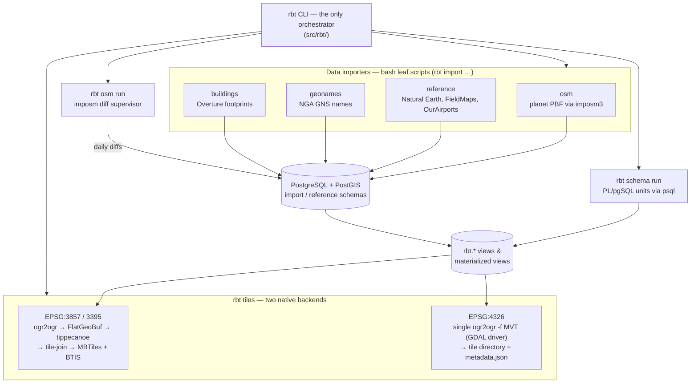
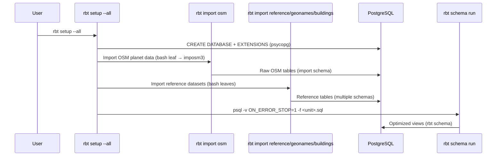
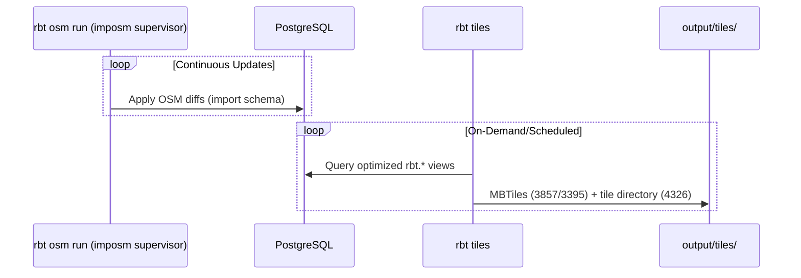
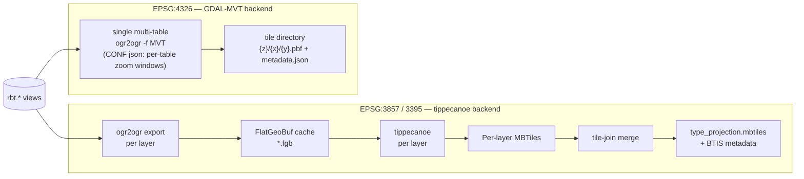

# RBT Vector Tiles Architecture

This document describes the system architecture, data flow, and design decisions for RBT Vector Tiles.

## 🏗️ System Overview

RBT Vector Tiles is designed as a two-phase system:

1. **Setup Phase**: One-time initialization of the database with global datasets
2. **Production Phase**: Continuous OSM updates and on-demand tile generation

Both phases are driven by a single entry point — the Python `rbt` CLI
(`src/rbt/`, [reference](cli.md)). The CLI orchestrates the bash data
importers, runs the schema SQL, supervises continuous OSM updates, and
dispatches one of **two native tile backends** depending on the target
projection:



### Orchestration Rule (the "hybrid" architecture)

The dispatch rule is strict and one-directional:

- The `rbt` CLI is the **only** orchestrator. No bash script calls Python,
  and no bash script calls another bash script.
- Four data importers remain bash **leaf scripts** by design (download +
  load of external datasets, reached via `rbt import {osm,reference,geonames,buildings}`).
  Each carries a `CONTRACT` header documenting its inputs and environment.
- Everything else — database bootstrap, schema processing, OSM update
  supervision, tile generation, health checks — is native Python under
  `src/rbt/`.
- The bash tile generators under `production/` are **deprecated**, reachable
  only through the `rbt tiles --mode bash` escape hatch until the
  [parity runbook](parity-runbook.md) retires them.

## 📂 Directory Architecture

### Separation of Concerns

The project is organized around the orchestrator/leaf split. See the
[Project Tour](project-structure.md#repository-layout) for the full annotated
directory tree — kept in one place so it can't drift between documents; the
summary here is just the shape of the split:

- **`src/rbt/`** — the Python CLI, the *only* orchestrator (`cli.py` +
  `commands/` for the Typer surface, `tiles/` for the two tile-generation
  backends, `importers/` for the bash-leaf wrappers).
- **`setup/data-sources/`** — the four bash leaf importers + PL/pgSQL schema
  sources.
- **`production/`** — deprecated bash tile generators, reachable only via
  `rbt tiles --mode bash` until the [parity runbook](parity-runbook.md)
  retires them.
- **`config/`** — `rbt.conf`, `layers.yml`, and the service configs
  (`postgresql.conf`, `tile-server.json`, `prometheus.yml`).
- **`tests/`**, **`docs/`**, **`output/`** — pytest suite, this MkDocs site,
  and generated artifacts (gitignored), respectively.

### Setup Phase (`rbt setup`)

**Purpose**: Initialize a fresh RBT database from scratch

**Key Components**:
- `src/rbt/setup_db.py` - Creates the database and extensions via psycopg,
  then sequences the steps in dependency order
- `setup/data-sources/` - Bash leaf importers organized by source type
- `setup/data-sources/schemas/` - PL/pgSQL files run by `rbt schema run`

**Execution Pattern**: Run once when setting up a new system
(`rbt setup --all`, or individual step flags to resume)

### Production Phase (`rbt osm run` / `rbt tiles`)

**Purpose**: Continuous operations on an initialized database

**Key Components**:
- `rbt tiles` - Native tile generation engine (`src/rbt/tiles/`)
- `rbt osm run` - Continuous OSM updates (supervised `imposm run`)
- `production/tile-generation/` - Deprecated bash generators, kept only for
  the `--mode bash` escape hatch

**Execution Pattern**: Run continuously or on-demand — see the
[Operations Guide](operations.md) for the Compose profiles and runbooks

## 🔄 Data Flow Architecture

### Phase 1: Data Ingestion



### Phase 2: Continuous Operations



## 🗄️ Database Architecture

### Schema Organization

| Schema | Purpose | Update Frequency |
|--------|---------|------------------|
| `import` | Raw OSM data from Imposm3 | Continuous (OSM updates) |
| `fieldmap` | Administrative boundaries | Static (setup only) |
| `naturalearth` | Cartographic reference data | Static (setup only) |
| `geonames` | Geographic names and places | Static (setup only) |
| `ourairports` | Aviation facilities | Static (setup only) |
| `overture` | Building footprints | Static (setup only) |
| `mirta` | Military installations | Static (setup only) |
| `rbt` | **Optimized views for tile generation** | Derived from above |

### View Architecture

The `rbt` schema contains optimized materialized views and regular views:

```sql
-- Example: Water processing pipeline
import.water (raw OSM) 
    → rbt.water_surface (filtered, classified)
    → rbt.water (clustered, merged)
    → rbt.water_simplified (low-zoom version)
```

### Performance Optimizations

1. **Materialized Views**: Pre-compute expensive spatial operations
2. **Strategic Indexing**: B-tree, GiST, and GIN trigram indexes
3. **Zoom-Level Views**: Progressive detail for different zoom levels
4. **Spatial Clustering**: Group nearby features for efficient rendering

## 🎯 Tile Generation Architecture

### Multi-Projection Support

| Projection | EPSG Code | Use Case | Tool Chain |
|------------|-----------|----------|------------|
| Web Mercator | 3857 | Standard web mapping | PostgreSQL → FlatGeoBuf → Tippecanoe → MBTiles (+ BTIS metadata) |
| World Mercator | 3395 | Better area preservation | PostgreSQL → FlatGeoBuf → Tippecanoe → MBTiles (+ BTIS metadata) |
| Geographic | 4326 | Latitude/longitude | PostgreSQL → GDAL MVT driver → tile directory (no tippecanoe) |

### Tile Generation Workflow

`TileEngine` (`src/rbt/tiles/engine.py`) reads the declarative layer registry
in `config/layers.yml` and selects the backend per projection:



!!! note "Why two backends?"
    Tippecanoe only understands Web-Mercator-family tiling, so the EPSG:4326
    dataset is cut directly from PostGIS by GDAL's MVT driver in **one**
    multi-table `ogr2ogr` call. Its `CONF` json maps zoom-variant view
    families (e.g. `rbt.contour_z8` … `rbt.contour`) onto a single target MVT
    layer with per-table zoom windows. The output is a tile *directory*, not
    an MBTiles file, and tile-join/BTIS do not apply.

### Layer Processing Strategy

**Physical Layers**:
- Terrain: contours, mountain labels
- Hydrology: water bodies, waterways, coastal features  
- Land Surface: vegetation, land use, glaciers, urban areas
- Recreation: parks, protected areas

**Cultural Layers**:
- Transportation: roads, railways, airports, ferry routes
- Boundaries: administrative boundaries at multiple levels
- Infrastructure: utilities, power systems, communication
- Buildings: footprints with height and classification
- Points of Interest: populated places, landmarks

## 🔧 Configuration Architecture

### Centralized Configuration

All configuration is centralized in the `config/` directory:

```
config/
├── rbt.conf              # Runtime settings (database, processing, tile generation)
├── layers.yml            # Declarative layer registry: layers, schema SQL units,
│                         #   and the gdal_mvt (EPSG:4326) dataset definitions
├── postgresql.conf       # PostgreSQL server tuning (mounted into the postgres container)
├── tile-server.json      # TileServer-GL data sources
└── prometheus.yml        # Prometheus scrape configuration
```

The CLI loads `rbt.conf` into an immutable `Settings` object
(`src/rbt/config.py`) with the precedence **CLI overrides → environment
variables → `config/rbt.conf` → built-in defaults**. Loading settings never
mutates the process environment; values destined for child processes (psql,
ogr2ogr, the bash leaf scripts) are passed explicitly as a bundled
`PG*`/`PG_*`/`DATABASE_*` environment. See the
[Configuration Reference](configuration.md) for every variable.

The `rbt.conf` file is organized into logical sections:

```bash
# Database Configuration
DATABASE_HOST=${PG_HOST:-localhost}
DATABASE_USER=${PG_USR:-postgres}
DATABASE_PASSWORD=${PG_PASS:-}

# Processing Settings
MAX_PARALLEL_JOBS=${MAX_PARALLEL_JOBS:-4}
RETRY_COUNT=${RETRY_COUNT:-3}

# Tile Generation Settings
TILE_CACHE_DIR=${TILE_CACHE_DIR:-./output/tiles}
DEFAULT_PROJECTION=${DEFAULT_PROJECTION:-3857}

# OSM Import Configuration
OSM_DATA_DIR=${OSM_DATA_DIR:-/mnt/data}
OSM_CACHE_DIR=${OSM_CACHE_DIR:-/mnt/cache}
```

### Environment-Based Configuration

Configuration supports environment variable overrides:

```bash
# Default from config file
MAX_PARALLEL_JOBS=4

# Override via environment
export MAX_PARALLEL_JOBS=8
```

## 🚀 Deployment Architecture

### Container Strategy

Two images cover every role:

1. **RBT Image** (`Dockerfile.production`, multi-stage):
   - GDAL/OGR, PostgreSQL client, tippecanoe (built from the felt fork),
     imposm3, and the `rbt` CLI installed in a venv on `PATH`
   - A single image backs `rbt-setup`, `rbt-osm-updates`, `rbt-tiles`, and
     `rbt-smoke` — the Compose `command:` selects the role
     (`rbt setup --all`, `rbt osm run`, `rbt tiles --all`, `rbt smoke`)
   - `HEALTHCHECK` runs `rbt health`

2. **Database Container** (`postgis/postgis`):
   - PostgreSQL with PostGIS extensions
   - Persistent data storage (`postgres_data` volume)
   - Tuned via `config/postgresql.conf`

### Orchestration

Docker Compose profiles enable different deployment modes:

```bash
# Setup phase
docker compose --profile setup up rbt-setup

# Production phase  
docker compose --profile production up -d

# With tile serving
docker compose --profile production --profile serve up -d
```

The full profile cookbook, OSM daemon lifecycle, and maintenance runbooks
live in the [Operations Guide](operations.md).

## 🔍 Monitoring Architecture

### Logging Strategy

Every mutating `rbt` invocation tees its output to a timestamped file under
`SHARED_LOG_DIR`:

```
output/logs/
├── rbt_<timestamp>.log            # Per-invocation CLI log (--log-file overrides)
├── schema_<key>_<timestamp>.log   # psql output per schema unit
└── osm_import.log                 # Planet import leaf script

output/tiles/<type>/<projection>/
├── <layer>_<projection>.log       # Per-layer export + tippecanoe log
├── merge_<projection>.log         # tile-join log
└── <type>_4326_mvt.log            # GDAL-MVT backend log
```

### Error Handling

- **Retry mechanisms**: Network-bound exports retry with a configurable
  count/delay (`RETRY_COUNT`/`RETRY_DELAY`)
- **Fail fast on SQL**: Schema units run with `psql -v ON_ERROR_STOP=1`, so a
  failing statement aborts that unit instead of silently continuing
- **Supervised updates**: `rbt osm run` forwards SIGTERM/SIGINT to imposm and
  escalates to SIGKILL after a 30 s grace period
- **Health probes**: `rbt health` backs the Docker `HEALTHCHECK`;
  `rbt validate` and `rbt smoke` cover pre-flight and end-to-end checks
  (see the [Operations Guide](operations.md))

### Performance Optimization

1. **Database Level**:
   - Materialized views for expensive operations
   - Strategic indexing (B-tree, GiST, GIN)
   - Parallel query execution
   - Optimized PostgreSQL configuration

2. **Processing Level**:
   - Parallel data import and processing
   - Efficient spatial algorithms (clustering, simplification)
   - Progressive enhancement (zoom-level specific views)
   - Smart feature selection and filtering

3. **Tile Generation Level**:
   - Multi-core tippecanoe processing (`-P` parallel input reading)
   - Efficient cached intermediate formats (FlatGeoBuf)
   - Per-layer tippecanoe parameters from the registry (`config/layers.yml`)
   - Tile consolidation (tile-join) and compression

## 📚 Related Documentation

- **[← Back to Home](index.md)**
- **[Getting Started Guide](getting-started.md)** - Setup walkthrough and first steps
- **[Operations Guide](operations.md)** - Day-2 runbooks: profiles, OSM daemon, maintenance
- **[`rbt` CLI Reference](cli.md)** - The full command surface
- **[Configuration Reference](configuration.md)** - `rbt.conf` and environment variables
- **[Physical Layers](physical-layers.md)** - Natural feature processing
- **[Cultural Layers](cultural-layers.md)** - Human infrastructure processing
- **[Database Initialization](database-initialization.md)** - Database setup process
- **[Parity Runbook](parity-runbook.md)** - Retiring the deprecated bash tile generators