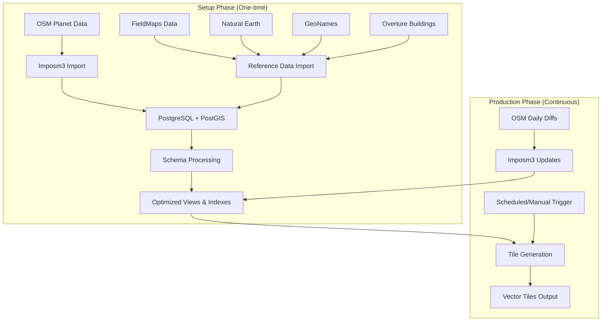
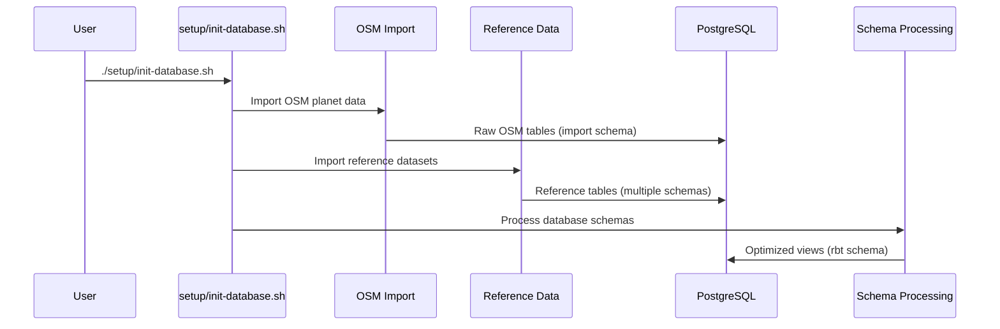
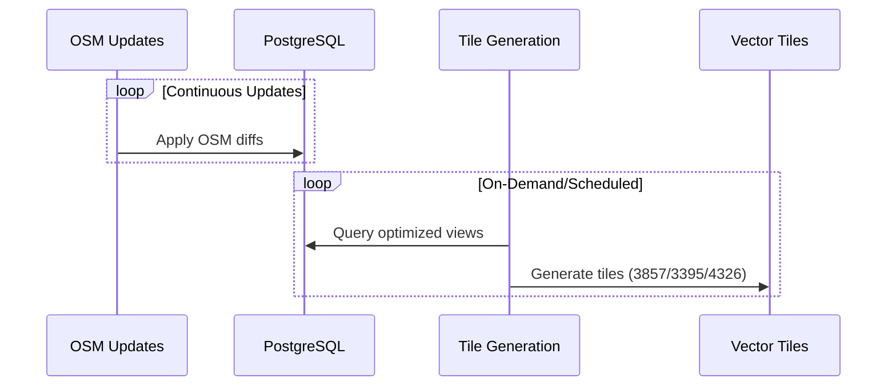
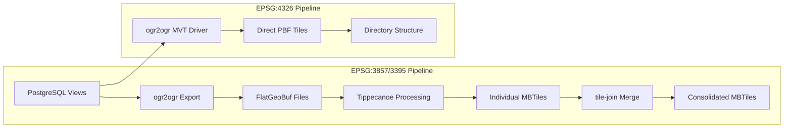

# RBT Vector Tiles Architecture

This document describes the system architecture, data flow, and design decisions for RBT Vector Tiles.

## 🏗️ System Overview

RBT Vector Tiles is designed as a two-phase system:

1. **Setup Phase**: One-time initialization of the database with global datasets
2. **Production Phase**: Continuous OSM updates and on-demand tile generation



## 📂 Directory Architecture

### Separation of Concerns

The project is organized around operational phases:

```
rbt-vector-tiles/
├── setup/           # One-time initialization (run once)
│   ├── init-database.sh          # Main setup orchestrator
│   ├── data-sources/             # Data import scripts
│   │   ├── osm/                  # OpenStreetMap import
│   │   ├── reference-data/       # Reference datasets
│   │   └── schemas/              # Database schema processing
│   └── README.md                 # Setup documentation
├── production/      # Continuous operations (run repeatedly)
│   ├── generate-tiles.sh         # Main tile generation orchestrator  
│   ├── update-osm.sh             # OSM continuous updates
│   ├── tile-generation/          # Projection-specific scripts
│   └── README.md                 # Production documentation
├── config/          # Configuration management
│   └── rbt.conf                  # Centralized configuration
├── tools/           # Utilities and maintenance
│   ├── validate-environment.sh   # Environment validation
│   ├── health-check.sh           # System health monitoring
│   └── ...                       # Other utility scripts
├── docs/            # Documentation
│   ├── getting-started.md        # Setup walkthrough
│   ├── architecture.md           # This document
│   └── ...                       # Layer-specific documentation
└── output/          # Generated outputs
    ├── tiles/                    # Vector tiles by projection
    ├── logs/                     # Processing logs
    └── temp/                     # Temporary processing files
```

### Setup Phase (`setup/`)

**Purpose**: Initialize a fresh RBT database from scratch

**Key Components**:
- `init-database.sh` - Main orchestration script
- `data-sources/` - Data import scripts organized by source type
- `schemas/` - SQL schema processing scripts

**Execution Pattern**: Run once when setting up a new system

### Production Phase (`production/`)

**Purpose**: Continuous operations on an initialized database

**Key Components**:
- `generate-tiles.sh` - Main tile generation orchestrator
- `update-osm.sh` - Continuous OSM updates
- `tile-generation/` - Projection-specific tile generation scripts

**Execution Pattern**: Run continuously or on-demand

## 🔄 Data Flow Architecture

### Phase 1: Data Ingestion



### Phase 2: Continuous Operations



## 🗄️ Database Architecture

### Schema Organization

| Schema | Purpose | Update Frequency |
|--------|---------|------------------|
| `import` | Raw OSM data from Imposm3 | Continuous (OSM updates) |
| `fieldmap` | Administrative boundaries | Static (setup only) |
| `naturalearth` | Cartographic reference data | Static (setup only) |
| `geonames` | Geographic names and places | Static (setup only) |
| `ourairports` | Aviation facilities | Static (setup only) |
| `overture` | Building footprints | Static (setup only) |
| `mirta` | Military installations | Static (setup only) |
| `rbt` | **Optimized views for tile generation** | Derived from above |

### View Architecture

The `rbt` schema contains optimized materialized views and regular views:

```sql
-- Example: Water processing pipeline
import.water (raw OSM) 
    → rbt.water_surface (filtered, classified)
    → rbt.water (clustered, merged)
    → rbt.water_simplified (low-zoom version)
```

### Performance Optimizations

1. **Materialized Views**: Pre-compute expensive spatial operations
2. **Strategic Indexing**: B-tree, GiST, and GIN trigram indexes
3. **Zoom-Level Views**: Progressive detail for different zoom levels
4. **Spatial Clustering**: Group nearby features for efficient rendering

## 🎯 Tile Generation Architecture

### Multi-Projection Support

| Projection | EPSG Code | Use Case | Tool Chain |
|------------|-----------|----------|------------|
| Web Mercator | 3857 | Standard web mapping | PostgreSQL → FlatGeoBuf → Tippecanoe → MBTiles |
| World Mercator | 3395 | Better area preservation | PostgreSQL → FlatGeoBuf → Tippecanoe → MBTiles + BTIS |
| Geographic | 4326 | Latitude/longitude | PostgreSQL → Direct MVT via GDAL |

### Tile Generation Workflow



### Layer Processing Strategy

**Physical Layers**:
- Terrain: contours, mountain labels
- Hydrology: water bodies, waterways, coastal features  
- Land Surface: vegetation, land use, glaciers, urban areas
- Recreation: parks, protected areas

**Cultural Layers**:
- Transportation: roads, railways, airports, ferry routes
- Boundaries: administrative boundaries at multiple levels
- Infrastructure: utilities, power systems, communication
- Buildings: footprints with height and classification
- Points of Interest: populated places, landmarks

## 🔧 Configuration Architecture

### Centralized Configuration

All configuration is centralized in the `config/` directory:

```
config/
└── rbt.conf              # Single configuration file with all settings
    ├── Database connection and performance
    ├── Processing parameters and limits  
    ├── OSM import configuration
    ├── Tile generation settings
    └── Resource limits and health checks
```

The `rbt.conf` file is organized into logical sections:

```bash
# Database Configuration
DATABASE_HOST=${PG_HOST:-localhost}
DATABASE_USER=${PG_USR:-postgres}
DATABASE_PASSWORD=${PG_PASS:-}

# Processing Settings
MAX_PARALLEL_JOBS=${MAX_PARALLEL_JOBS:-4}
RETRY_COUNT=${RETRY_COUNT:-3}

# Tile Generation Settings
TILE_CACHE_DIR=${TILE_CACHE_DIR:-./output/tiles}
DEFAULT_PROJECTION=${DEFAULT_PROJECTION:-3857}

# OSM Import Configuration
OSM_DATA_DIR=${OSM_DATA_DIR:-/mnt/data}
OSM_CACHE_DIR=${OSM_CACHE_DIR:-/mnt/cache}
```

### Environment-Based Configuration

Configuration supports environment variable overrides:

```bash
# Default from config file
MAX_PARALLEL_JOBS=4

# Override via environment
export MAX_PARALLEL_JOBS=8
```

## 🚀 Deployment Architecture

### Container Strategy

Three specialized containers:

1. **Setup Container** (`Dockerfile.setup`):
   - Heavy dependencies for data processing
   - One-time database initialization
   - Ephemeral - removed after setup

2. **Production Container** (`Dockerfile.production`):
   - Lightweight runtime dependencies
   - Continuous OSM updates
   - On-demand tile generation

3. **Database Container** (`postgis/postgis`):
   - PostgreSQL with PostGIS extensions
   - Persistent data storage
   - Optimized configuration

### Orchestration

Docker Compose profiles enable different deployment modes:

```bash
# Setup phase
docker-compose --profile setup up

# Production phase  
docker-compose --profile production up -d

# With tile serving
docker-compose --profile production --profile serve up -d
```

## 🔍 Monitoring Architecture

### Logging Strategy

Structured logging with different levels:

```
output/logs/
├── database_init_*.log     # Setup phase logs
├── tile_generation_*.log   # Tile generation logs
├── osm_updates_*.log       # OSM update logs
└── system_metrics_*.log    # Performance metrics
```

### Error Handling

- **Graceful degradation**: Continue processing even if some components fail
- **Retry mechanisms**: Automatic retry with exponential backoff
- **State preservation**: Transactions ensure partial work is saved
- **Recovery procedures**: Clear steps for common failure scenarios

### Performance Optimization

1. **Database Level**:
   - Materialized views for expensive operations
   - Strategic indexing (B-tree, GiST, GIN)
   - Parallel query execution
   - Optimized PostgreSQL configuration

2. **Processing Level**:
   - Parallel data import and processing
   - Efficient spatial algorithms (clustering, simplification)
   - Progressive enhancement (zoom-level specific views)
   - Smart feature selection and filtering

3. **Tile Generation Level**:
   - Parallel tile generation across projections
   - Efficient intermediate formats (FlatGeoBuf)
   - Optimized tippecanoe parameters
   - Tile consolidation and compression

## 📚 Related Documentation

- **[← Back to Home](index.md)**
- **[Getting Started Guide](getting-started.md)** - Setup walkthrough and first steps
- **[Physical Layers](physical-layers.md)** - Natural feature processing
- **[Cultural Layers](cultural-layers.md)** - Human infrastructure processing
- **[Database Initialization](database-initialization.md)** - Database setup process
- **[Setup Documentation](setup-readme.md)** - Detailed setup information
- **[Production Documentation](production-readme.md)** - Continuous operations