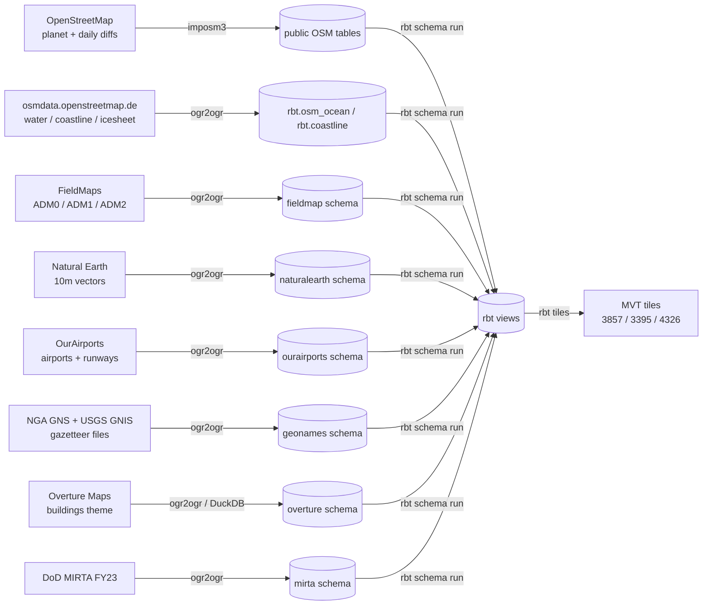

# Data Sources & Licensing

Every byte in the generated tiles comes from one of the open datasets below.
The four importers (`rbt import osm|reference|geonames|buildings`) download
and load them into dedicated PostgreSQL schemas; the SQL units under
`setup/data-sources/schemas/` (run via `rbt schema run --all`) then derive the
`rbt.*` views that [`config/layers.yml`](https://github.com/MJJ203/rbt-data-generator/blob/main/config/layers.yml)
maps to tile layers.

!!! warning "Licensing summary"
    The repository's **code** is GPL-3.0. The **tiles** you generate are
    derivative works of the data and inherit the data licenses below —
    most importantly ODbL share-alike from OpenStreetMap and Overture.
    The canonical license table lives in
    [ATTRIBUTION.md](https://github.com/MJJ203/rbt-data-generator/blob/main/ATTRIBUTION.md).

## OpenStreetMap

- **Importer:** `rbt import osm` → `src/rbt/importers/osm.py`
- **License:** [ODbL 1.0](https://opendatacommons.org/licenses/odbl/1-0/) —
  attribution "© OpenStreetMap contributors" is **mandatory**, share-alike
  applies to derivative databases. See the
  [OSM copyright page](https://www.openstreetmap.org/copyright).
- **Download mechanism:** `aria2c` fetches `planet-latest.osm.pbf` from a
  mirror pool (spline.de, gwdg.de, fau.de, your.org, bbbike.org, nluug.nl,
  osuosl.org, utwente.nl, planet.openstreetmap.org); the importer fetches
  daily replication diffs from `planet.openstreetmap.org/replication/day/`
  in parallel. Diffs are merged with `osmium`, applied with `osmosis`, and
  the result is imported by **imposm3** using
  `setup/data-sources/osm/imposm-mapping.yaml`.
- **Update cadence:** OSM publishes new planet files weekly and replication
  diffs daily/minutely. After the initial import, `rbt osm run` keeps the
  database current by supervising `imposm run` against the daily diff stream.
- **Feeds:** the majority of cultural layers — `highway`, `railway`, `ferry`,
  `port_*`, `railway_station*`, `lock*`, `yard_label` (transportation);
  `dam_*`, `powerline`, `pipeline`, `utility_point`, `power_station*`,
  `pumping_station*`, `grain_*`, `hydrocarbon_*` (utilities); `cemetery*`,
  `stadium_*`, `radar_point`, `populated_places`, and the OSM half of
  `aeroway_surface`/`runway_curve`. On the physical side: `waterway`,
  `landcover*`, `park`, `mountain_label`, `inland_water_intermittent`, the
  high-zoom halves of `glacier` and `builtuparea`, and the inland-water
  component of `water`.

### OSM-derived coastline products (osmdata.openstreetmap.de)

`rbt import reference` also loads four pre-processed shapefile products that
the OSM community derives from the coastline:

| Download | Table | Used by |
|---|---|---|
| `water-polygons-split-4326.zip` | `rbt.osm_ocean` | `water` (z10+) |
| `simplified-water-polygons-split-3857.zip` | `rbt.osm_ocean_simplified` | `water` (low zooms via `rbt.water_simplified`) |
| `coastlines-split-4326.zip` | `rbt.coastline` | Loaded but not currently referenced by any schema SQL — water/ocean splitting uses `osm_ocean`/`osm_ocean_simplified` instead. Kept for future coastline processing. |
| `antarctica-icesheet-polygons-3857.zip` | `rbt.osm_antarctica_icesheet` | `glacier` (z7+ via `rbt.glacier_osm`) |

These are regenerated daily by [osmdata.openstreetmap.de](https://osmdata.openstreetmap.de/)
and carry the same ODbL terms as OSM itself.

## FieldMaps administrative boundaries

- **Importer:** `rbt import reference` → `src/rbt/importers/reference.py`
- **Two distinct editions are used — they have different provenance:**
    - **ADM0** (country polygons, lines, label points) comes from the
      [ADM0 OSM edition](https://fieldmaps.io/data/adm0), "all" worldview
      (`data.fieldmaps.io/adm0/osm/all/adm0_{polygons,lines,points}.parquet`).
      It combines OSM coastlines with U.S. Department of State LSIB
      boundaries. **License: ODbL** (it is OSM-derived); attribution
      "FieldMaps, U.S. Department of State, OpenStreetMap".
    - **ADM1/ADM2** (subnational polygons, lines, label points) come from the
      [Edge-Matched Humanitarian edition](https://fieldmaps.io/data/edge-matched),
      "intl" worldview
      (`data.fieldmaps.io/edge-matched/humanitarian/intl/adm{1,2}_{polygons,lines,points}.parquet`).
      It blends UN OCHA Common Operational Datasets (CC BY 3.0 IGO) with
      geoBoundaries (CC BY 4.0), edge-matched to the OSM ADM0 layer.
      FieldMaps publishes the combined product under **ODbL**; attribution
      "FieldMaps, UN OCHA, geoBoundaries, U.S. Department of State,
      OpenStreetMap".
- **Download mechanism:** `ogr2ogr` streams the GeoParquet files directly
  over HTTP (`/vsicurl/`) into the `fieldmap` schema. A `fieldmap.usa`
  helper table is derived from ADM0 for US-territory clipping.
- **Update cadence:** FieldMaps regenerates its products periodically; the
  importer always fetches the latest published GeoParquet (no version pin).
- **Feeds:** all six boundary layers — `adm0_labels`, `adm0_lines`,
  `adm1_labels`, `adm1_lines`, `adm2_labels`, `adm2_lines`. `rbt.adm0_labels`
  additionally joins NGA GNS (`geonames.administrative_regions`) and Natural
  Earth (`ne_10m_admin_0_countries`) for alternate country names.

## Natural Earth

- **Importer:** `rbt import reference`
- **License:** [public domain](https://www.naturalearthdata.com/about/terms-of-use/)
  — no attribution required ("Made with Natural Earth" is a courtesy).
- **Download mechanism:** `ogr2ogr` reads the full
  `natural_earth_vector.gpkg` directly from the zipped package at
  `naciscdn.org/naturalearth/packages/natural_earth_vector.gpkg.zip`,
  addressing the inner GeoPackage member path
  (`.../natural_earth_vector.gpkg.zip/packages/natural_earth_vector.gpkg`)
  via GDAL's `/vsizip//vsicurl/` chained virtual filesystem, into the
  `naturalearth` schema.
- **Update cadence:** versioned releases (currently the 5.x series),
  infrequent; the importer fetches whatever the CDN serves as current.
- **Feeds:** the low-zoom halves of blended physical layers —
  `builtuparea` z3–8 (`ne_10m_urban_areas`), `glacier` low zooms
  (`ne_10m_glaciated_areas` + `ne_10m_antarctic_ice_shelves_polys`),
  `ne_water_labels` (`ne_10m_geography_marine_polys`), mountain-region
  context for `mountain_label` (`ne_10m_geography_regions_polys`), and
  country-name enrichment in `adm0_labels` (`ne_10m_admin_0_countries`).

## OurAirports

- **Importer:** `rbt import reference`
- **License:** [public domain dedication](https://ourairports.com/data/) —
  "All data is released to the Public Domain, and comes with no guarantee of
  accuracy or fitness for use."
- **Download mechanism:** `ogr2ogr` reads `airports.csv` and `runways.csv`
  straight from the `main` branch of the GitHub mirror
  (`raw.githubusercontent.com/davidmegginson/ourairports-data/refs/heads/main/`)
  into `ourairports.airport` and `ourairports.runway`.
- **Update cadence:** community-maintained and continuously updated; the
  GitHub mirror tracks the live database, and the importer reads `main`.
- **Feeds:** the aeroway layers — `airports`, `heliports`, and (joined with
  OSM aeroway geometry) `aeroway_surface` and `runway_curve`.

## NGA GNS and USGS GNIS gazetteers

- **Importer:** `rbt import geonames` → `src/rbt/importers/geonames.py`
- **License:** U.S. Government works — public domain. NGA states there are
  "no licensing requirements or restrictions in place for the use of the GNS
  data"; the same applies to USGS GNIS.
- **Download mechanism:** the importer fetches nine GNS feature-class zips
  (Administrative_Regions, Hydrographic, Hypsographic, Populated_Places,
  Areas_Localities, Undersea, Transportation_Networks, Spot_Features,
  Vegetation) from `geonames.nga.mil/geonames/GNSData/fc_files/` in
  parallel, plus two US-national GNIS files (PopulatedPlaces_National,
  HistoricalFeatures_National) from the USGS National Map S3 bucket
  (`prd-tnm.s3.amazonaws.com`). Tab-separated text is converted to CSV
  (fields containing commas are quoted correctly) and loaded with `ogr2ogr`
  into the `geonames` schema.
- **Update cadence:** NGA refreshes GNS export files on a recurring schedule;
  USGS refreshes GNIS files periodically. The importer fetches the current
  files (no version pin).
- **Feeds:** `geonames_hydrographic` (named-water labels, from
  `geonames.hydrographic` filtered by water-body area) and the GNS country
  names in `adm0_labels` (`geonames.administrative_regions`). The remaining
  GNS/GNIS tables are staged in the `geonames` schema and are not yet
  referenced by an `rbt.*` tile view.

!!! note "NGA GNS is not geonames.org"
    This pipeline downloads from **geonames.nga.mil** — the GEOnet Names
    Server maintained by the U.S. National Geospatial-Intelligence Agency,
    sanctioned by the U.S. Board on Geographic Names, and in the public
    domain. Despite the similar name, it has no relationship to
    **geonames.org**, the community gazetteer licensed CC BY 4.0. No
    geonames.org data is used, and geonames.org attribution requirements do
    **not** apply.

## Overture Maps buildings

- **Importer:** `rbt import buildings` → `src/rbt/importers/buildings.py`
- **License:** [ODbL 1.0](https://docs.overturemaps.org/attribution/). The
  Overture buildings theme incorporates OpenStreetMap (plus
  Microsoft ML Building Footprints, Esri Community Maps, Google Open
  Buildings and others), so the ODbL governs the combined theme.
  Required attribution: "© OpenStreetMap contributors, Overture Maps
  Foundation".
- **Download mechanism:** `aws s3 sync --no-sign-request` against
  `s3://overturemaps-us-west-2/release/2026-06-17.0/theme=buildings/`
  (release pinned via `OVERTURE_RELEASE`, overridable per run with
  `rbt import buildings --release`), then `ogr2ogr` loads `type=building`
  and `type=building_part` GeoParquet into `overture.building` /
  `overture.buildingpart`. An alternative high-throughput path,
  `tools/duckdb-building-export.sql` (see
  [DuckDB Buildings Export](duckdb-buildings.md)), reads the GeoParquet
  directly with DuckDB and exports FlatGeoBuf — both paths are pinned to
  the same release.
- **Update cadence:** Overture publishes versioned releases roughly monthly
  and only retains a rolling window of recent releases on the public S3
  bucket (older releases 404 once superseded) — verify with `aws s3 ls
  --no-sign-request --region us-west-2 s3://overturemaps-us-west-2/release/`
  before pinning a new one. Bumping the release is a deliberate change that
  must update **both** the `OVERTURE_RELEASE` default and the DuckDB script
  together, since they are expected to reference the same release.
- **Feeds:** the `building` layer (`rbt.building`, plus the area-filtered
  `rbt.building_z10/z11/z12` zoom variants used by the 4326 backend).

## MIRTA (DoD military installations)

- **Importer:** `rbt import reference`
- **License:** produced by the U.S. Department of Defense (OSD Defense
  Installations Spatial Data Infrastructure program). As a U.S. Government
  work it is public domain; the download page publishes no explicit license
  text, so **verify before release** if you redistribute this layer
  commercially.
- **Download mechanism:** the importer fetches `installations_ranges.zip`
  from `www.acq.osd.mil/eie/imr/rpid/disdi/Downloads/` (with a documented
  TLS-verification exception — see
  [SECURITY.md](https://github.com/MJJ203/rbt-data-generator/blob/main/SECURITY.md)),
  and `ogr2ogr` loads the `MirtaLocations_A` feature class from
  `FY23_MIRTA_Final.gdb` into `mirta.us_military_installations`.
- **Update cadence:** annual fiscal-year releases; the importer pins FY23.
- **Feeds:** `us_military_installations` and
  `us_military_installations_labels`.

## ODbL share-alike: what it means for your tiles

If you only run this pipeline internally, nothing below applies — ODbL
obligations attach when you **publicly distribute** the tiles or a service
backed by them. When you do:

1. **Attribute.** Render "© OpenStreetMap contributors" on the map (or
   another notice reasonably calculated to reach users, e.g. an about page
   for API-only access). Credit Overture, FieldMaps, and the other sources
   where their layers are served.
2. **Share-alike.** A tile set built from OSM/Overture data is a derivative
   database. If you distribute it, you must make it available under ODbL —
   you cannot impose additional restrictions on the data itself, and on
   request you must provide the derivative database (or the means to
   reproduce it; this repository's importers and SQL satisfy that for
   unmodified pipelines).
3. **No data lock-up.** You may sell access, bundle the tiles in a product,
   or serve them behind authentication — but the underlying data terms
   travel with the tiles, and recipients keep their ODbL rights.

The public-domain sources (Natural Earth, OurAirports, NGA GNS, USGS GNIS,
MIRTA) add no obligations of their own, but because the pipeline blends them
into the same tile sets as ODbL data, treat every distributed tile set as
ODbL-governed unless you generate it exclusively from public-domain layers.

The repository's GPL-3.0 license covers the code only; see
[ATTRIBUTION.md](https://github.com/MJJ203/rbt-data-generator/blob/main/ATTRIBUTION.md)
for the per-dataset license table and the exact attribution strings.
