# Database Initialization

One-time population of the PostGIS database with global datasets, orchestrated
by the `rbt` CLI. The bootstrap (database + extensions) and schema processing
are native Python; the four data importers remain Bash leaf scripts under
`setup/data-sources/` that the CLI invokes with a fully resolved environment.

## 📋 Table of Contents

- [Overview](#overview)
- [Architecture](#architecture)
- [Entry Points](#entry-points)
- [The Importer Leaf Scripts](#the-importer-leaf-scripts)
- [Tools and Technologies](#tools-and-technologies)
- [Database Structure](#database-structure)
- [Data Sources](#data-sources)
- [Usage](#usage)
- [Schema Processing](#schema-processing)
- [Configuration](#configuration)
- [Troubleshooting](#troubleshooting)

## Overview

`rbt setup --all` runs the full initialization in dependency order:

1. **Bootstrap** (`rbt setup --setup-database`) — creates the database and
   extensions (`postgis`, `postgis_raster`, `hstore`, `pg_trgm`) via psycopg
   (`src/rbt/setup_db.py`).
2. **Data import** — four modular Bash leaf scripts, each independently
   re-runnable via `rbt import`:
    - `rbt import osm` → `setup/data-sources/osm/import-osm-data.sh`
    - `rbt import reference` → `setup/data-sources/reference-data/import-reference-data.sh`
    - `rbt import geonames` → `setup/data-sources/reference-data/import-geonames.sh`
    - `rbt import buildings` → `setup/data-sources/reference-data/import-buildings.sh`
3. **Schema processing** (`rbt schema run --all`) — executes the eight
   PL/pgSQL files under `setup/data-sources/schemas/` through `psql` to build
   the `rbt.*` views consumed by tile generation.

The importer scripts are designed for CI/CD pipelines and containerized
environments, featuring:

- ✅ Parallel processing for faster data ingestion
- ✅ Automatic retry mechanisms with configurable attempts
- ✅ Comprehensive logging with timestamps
- ✅ Graceful error handling and cleanup
- ✅ Progress tracking and colored output
- ✅ Container-friendly signal handling

## Architecture

### Processing Flow

```mermaid
flowchart TD
    A["rbt setup --all"] --> B["Bootstrap<br/>CREATE DATABASE + EXTENSIONS<br/>(psycopg)"]
    B --> C["rbt import osm<br/>import-osm-data.sh"]
    B --> D["rbt import reference<br/>import-reference-data.sh"]
    B --> E["rbt import geonames<br/>import-geonames.sh"]
    B --> F["rbt import buildings<br/>import-buildings.sh"]
    C --> G[("PostgreSQL + PostGIS")]
    D --> G
    E --> G
    F --> G
    G --> H["rbt schema run --all<br/>8 PL/pgSQL units via psql"]
    H --> I["rbt.* views ready for rbt tiles"]
```



## Entry Points

=== "rbt CLI"

    ```bash
    # Complete initialization (recommended)
    rbt setup --all

    # Run individual steps
    rbt setup --setup-database          # bootstrap only
    rbt setup --import-osm-data
    rbt setup --import-reference-data
    rbt setup --import-geonames
    rbt setup --import-buildings
    rbt setup --process-schemas

    # Preview the plan without executing
    rbt setup --all --dry-run
    ```

=== "Docker Compose"

    ```bash
    # The setup profile runs `rbt setup --all` against the postgres service
    docker compose --profile setup up rbt-setup

    # Re-run a single step inside the image
    docker compose run --rm rbt-setup rbt setup --import-geonames
    ```

!!! note "Replaced scripts"
    `rbt setup` replaces the former `setup/init-database.sh`, and
    `rbt schema run` replaces the `process-physical-schemas.sh` /
    `process-cultural-schemas.sh` wrappers. Those scripts no longer exist.

## The Importer Leaf Scripts

**Location**: `setup/data-sources/*/`

Each script carries a `CONTRACT` header documenting its inputs, outputs, and
exit behavior. They are invoked only through the `rbt` CLI, which resolves and
exports the `DATABASE_*`/`PG*` environment they expect — do not run them
directly.

| Entry point | Leaf script | Loads |
|---|---|---|
| `rbt import osm` | `osm/import-osm-data.sh` | OpenStreetMap planet via Imposm3 |
| `rbt import reference` | `reference-data/import-reference-data.sh` | FieldMaps, Natural Earth, OurAirports, MIRTA, OSM ocean/Antarctica |
| `rbt import geonames` | `reference-data/import-geonames.sh` | NGA GNS geographic names (parallel download) |
| `rbt import buildings` | `reference-data/import-buildings.sh` | Overture Maps building footprints from S3 |

Extra arguments after the subcommand are passed through to the script, and
`--dry-run` prints the command without executing:

```bash
rbt import osm --dry-run
rbt import osm -- --download-planet
```

**Key features**:

- Independent execution capability
- Parallel processing within each component
- Smart table existence checking (re-runs skip completed work)
- Automatic retry mechanisms
- AWS S3 sync for the large Overture dataset, with incremental download
  support and optimized PostgreSQL COPY operations

## Tools and Technologies

### Core Dependencies

#### **ogr2ogr** (GDAL/OGR)

Primary tool for spatial data translation and loading. Key parameters used:

```bash
ogr2ogr -progress \                    # Show progress bar
    -f "PostgreSQL" \                   # Output format
    --config PG_USE_COPY YES \          # Use fast COPY instead of INSERT
    "PG:host=... dbname=... user=..." \# Connection string
    -lco GEOMETRY_NAME=geometry \       # Geometry column name
    -lco DIM=2 \                        # Force 2D geometries
    -lco UNLOGGED=ON \                  # Create unlogged tables (faster)
    -nlt MULTIPOLYGON \                 # Force geometry type
    -skipfailures \                     # Continue on errors
    -overwrite \                        # Replace existing data
    input_file                          # Input data source
```

**Common Layer Creation Options (-lco)**:

- `GEOMETRY_NAME`: Name of the geometry column (default: geometry)
- `DIM`: Coordinate dimension (2 for 2D, 3 for 3D)
- `UNLOGGED`: Create unlogged tables for faster initial load
- `PRECISION`: Control coordinate precision

**Configuration Options (--config)**:

- `PG_USE_COPY`: Use PostgreSQL COPY command for bulk loading
- Thread and memory settings for performance

#### **psql** (PostgreSQL Client)

Used for:

- Database connectivity testing
- Direct SQL execution
- Table existence verification
- Schema processing — `rbt schema run` shells out to
  `psql -v ON_ERROR_STOP=1 -f <unit>.sql`

#### **PostGIS Extensions**

Spatial database extensions providing:

- **postgis**: Core spatial types and functions
  - Geometry types (POINT, LINESTRING, POLYGON, etc.)
  - Spatial relationship functions (ST_Intersects, ST_Contains)
  - Measurement functions (ST_Area, ST_Distance)
- **postgis_raster**: Raster data support
- **hstore**: Key-value storage for tags/attributes
- **pg_trgm**: Trigram indexes for fuzzy text matching

### Supporting Utilities

- **wget**: HTTP/HTTPS file downloads with retry support
- **aws**: S3 data synchronization (Overture data)
- **7z**: Archive extraction for compressed datasets
- **unzip**: ZIP file extraction
- **timeout**: Command execution time limits

## Database Structure

### Schemas Created

| Schema | Purpose | Tables |
|--------|---------|--------|
| **fieldmap** | Administrative boundaries | adm0, adm1, adm2, adm0_lines, adm1_lines, adm2_lines, adm0_labels, adm1_labels, adm2_labels, usa |
| **naturalearth** | Natural Earth features | ne_10m_admin_0_countries, ne_10m_populated_places, ne_10m_rivers_lake_centerlines, etc. |
| **ourairports** | Aviation data | airport, runway |
| **rbt** | Core spatial data + tile views | osm_ocean, osm_ocean_simplified, osm_antarctica_icesheet, plus the views created by `rbt schema run` |
| **mirta** | Military installations | us_military_installations |
| **geonames** | Geographic names | administrative_regions, hydrographic, hypsographic, populated_places, etc. |
| **overture** | Building footprints | building, buildingpart |

### Table Details

#### FieldMaps Tables

Administrative boundary polygons and lines with hierarchical levels:

- **adm0**: Country boundaries (MULTIPOLYGON)
- **adm1**: State/province boundaries (MULTIPOLYGON)
- **adm2**: County/district boundaries (MULTIPOLYGON)
- **adm*_lines**: Boundary lines (MULTILINESTRING)
- **adm*_labels**: Label points (POINT)

#### Natural Earth Tables

Comprehensive geographic features at multiple scales (1:10m, 1:50m, 1:110m):

- Political boundaries
- Physical features (lakes, rivers, coastlines)
- Cultural features (populated places, urban areas)
- Each table includes attributes for styling and labeling

#### GeoNames Tables

Point features with geographic names and classifications:

```sql
-- Example structure
CREATE TABLE geonames.populated_places (
    ogc_fid SERIAL PRIMARY KEY,
    geometry geometry(Point, 4326),
    name VARCHAR,
    feature_class VARCHAR,
    feature_code VARCHAR,
    country_code VARCHAR,
    population INTEGER,
    elevation INTEGER,
    -- Additional attributes...
);
```

### Spatial Indexes

All geometry columns automatically receive spatial indexes via ogr2ogr:

```sql
CREATE INDEX idx_tablename_geometry 
ON schema.tablename 
USING GIST (geometry);
```

## Data Sources

### Primary Sources

| Dataset | Provider | Format | Update Frequency |
|---------|----------|--------|------------------|
| FieldMaps | FieldMaps.io | GeoPackage | Regular |
| Natural Earth | Natural Earth Data | GeoPackage | Version releases |
| OurAirports | OurAirports Community | CSV | Daily |
| OSM Ocean/Antarctica | OpenStreetMap | Shapefile | Periodic |
| MIRTA | US DoD | File Geodatabase | Annual |
| GeoNames | NGA | CSV/TXT | Regular |
| Overture Buildings | Overture Maps | Parquet | Monthly |

### Data URLs

Data is fetched from authoritative sources:

- FieldMaps: `https://data.fieldmaps.io/`
- Natural Earth: `https://naciscdn.org/naturalearth/`
- OurAirports: `https://raw.githubusercontent.com/davidmegginson/ourairports-data/`
- OSM: `https://osmdata.openstreetmap.de/`
- GeoNames: `https://geonames.nga.mil/`
- Overture: `s3://overturemaps-us-west-2/`

## Usage

### Prerequisites

Configure the database connection in `config/rbt.conf` (or override via
environment variables — legacy `PG_*` names are still accepted):

```bash
DATABASE_HOST=localhost
DATABASE_USER=postgres
DATABASE_PASSWORD=password

# Optional tuning
MAX_PARALLEL_JOBS=4
RETRY_COUNT=3
```

Then verify the environment:

```bash
rbt validate
```

### Basic Execution

```bash
# Run complete database initialization (recommended)
rbt setup --all

# Or run individual importers separately
rbt import osm
rbt import reference
rbt import geonames
rbt import buildings
```

### Advanced Execution

```bash
# Preview without executing
rbt setup --all --dry-run

# Debug-level CLI logging
rbt --debug setup --all

# The leaf scripts honor SCRIPT_* settings from config/rbt.conf;
# override per run via the environment
SCRIPT_PARALLEL_INGESTION=true rbt setup --all
SCRIPT_CLEAN_TEMP_FILES=false rbt import buildings
SCRIPT_MAX_PARALLEL_JOBS=8 rbt import reference
```

## Schema Processing

Schema units are registered in the `schemas:` block of `config/layers.yml`
and executed by `rbt schema run` via `psql -v ON_ERROR_STOP=1` (a failing
statement aborts that unit — stricter than the old bash wrappers, which
continued past errors).

```bash
# Discover the registered units
rbt schema list

# Run everything (what `rbt setup --process-schemas` does)
rbt schema run --all

# Run by layer type
rbt schema run --type physical
rbt schema run --type cultural

# Run individual units by key
rbt schema run water landcover
rbt schema run highway --dry-run
```

| Key | Type | SQL file |
|---|---|---|
| `physical` | physical | `setup/data-sources/schemas/physical/physical-core.sql` |
| `landcover` | physical | `setup/data-sources/schemas/physical/landcover.sql` |
| `water` | physical | `setup/data-sources/schemas/physical/water-features.sql` |
| `contour` | physical | `setup/data-sources/schemas/physical/terrain.sql` |
| `cultural` | cultural | `setup/data-sources/schemas/cultural/cultural-core.sql` |
| `highway` | cultural | `setup/data-sources/schemas/cultural/transportation.sql` |
| `railway` | cultural | `setup/data-sources/schemas/cultural/transportation-railway.sql` |
| `aero` | cultural | `setup/data-sources/schemas/cultural/infrastructure.sql` |

Each unit logs to `output/logs/schema_<key>_<timestamp>.log`.

## Configuration

### Key Variables

Resolved by `src/rbt/config.py` with precedence: environment variables →
`config/rbt.conf` → built-in defaults. See
[configuration.md](configuration.md) for the complete reference.

| Variable | Default | Description |
|----------|---------|-------------|
| **DATABASE_HOST** | `localhost` | PostgreSQL host (legacy: `PG_HOST`) |
| **DATABASE_USER** | `postgres` | PostgreSQL username (legacy: `PG_USR`) |
| **DATABASE_PASSWORD** | *(unset)* | PostgreSQL password (legacy: `PG_PASS`) |
| **MAX_PARALLEL_JOBS** | 4 | Maximum concurrent jobs |
| **RETRY_COUNT** | 3 | Attempts per operation |
| **RETRY_DELAY** | 30 | Seconds between retries |
| **SCRIPT_PARALLEL_INGESTION** | false | Enable full parallel mode in the importers |
| **SCRIPT_DEBUG** | false | Enable importer debug output |
| **SCRIPT_CLEAN_TEMP_FILES** | false | Remove temp files after completion |
| **SHARED_LOG_DIR** | ./output/logs | Log file directory |
| **SHARED_TEMP_DIR** | ./output/temp | Temporary file directory |

### Performance Tuning

For optimal performance, consider these PostgreSQL settings:

```sql
-- Increase work memory for sorting/indexing
SET work_mem = '256MB';

-- Increase maintenance work memory for index creation
SET maintenance_work_mem = '1GB';

-- Disable autovacuum during bulk load
ALTER TABLE schema.table SET (autovacuum_enabled = false);

-- Re-enable and analyze after load
ALTER TABLE schema.table SET (autovacuum_enabled = true);
ANALYZE schema.table;
```

## Troubleshooting

### Common Issues

#### 1. Connection Failures

```bash
# rbt validate reports each resolved connection value and tests the DB
rbt validate

# Or test manually
psql "host=$DATABASE_HOST dbname=rbt user=$DATABASE_USER password=$DATABASE_PASSWORD" -c "SELECT 1;"
```

#### 2. Missing Dependencies

```bash
# rbt validate checks every required and optional tool with versions
rbt validate
```

#### 3. Disk Space Issues

```bash
# Monitor temp directory usage
du -sh ./output/temp/
# Clean up if needed
rm -rf ./output/temp/*
```

#### 4. Failed Jobs

```bash
# Check the per-invocation CLI log
tail -n 50 output/logs/rbt_*.log
# Importer leaf-script logs
tail -n 50 output/logs/database_setup_*.log
# Review specific parallel-job output
cat output/temp/job_name.log
```

### Debug Mode

Enable comprehensive debugging:

```bash
SCRIPT_DEBUG=true SCRIPT_VERBOSE=true SCRIPT_CLEAN_TEMP_FILES=false rbt setup --all
```

This preserves all temporary files and provides detailed execution traces.

### Log Files

Logs are centralized under `$SHARED_LOG_DIR` (default `./output/logs`):

- CLI logs: `rbt_YYYYMMDD_HHMMSS.log`
- Importer logs: `database_setup_*.log`, `geonames_setup_*.log`, `overture_buildings_*.log`, `osm_import.log`
- Schema logs: `schema_<key>_YYYYMMDD_HHMMSS.log`
- Job-specific logs (parallel processing): `${SHARED_TEMP_DIR}/[job_name].log`

## Best Practices

1. **Pre-flight Checks**: Run `rbt validate` before running setup
2. **Incremental Loading**: Importers check for existing tables to avoid redundant work — re-running `rbt setup` is safe
3. **Resource Management**: Adjust `MAX_PARALLEL_JOBS` based on system capacity
4. **Monitoring**: Use `SCRIPT_DEBUG=true` for first-time runs
5. **Backup**: Consider backing up the database before major ingestions
6. **Post-Processing**: Run ANALYZE on tables after loading for query optimization

## 📚 Related Documentation

- **[← Back to Home](index.md)**
- **[Getting Started Guide](getting-started.md)** - Setup walkthrough and first steps
- **[Architecture Overview](architecture.md)** - System design and data flow
- **[OSM Import Pipeline](osm-import.md)** - OpenStreetMap data processing details
- **[Physical Layers](physical-layers.md)** - Natural feature processing
- **[Cultural Layers](cultural-layers.md)** - Human infrastructure processing
- **[Setup Documentation](setup-readme.md)** - Complete setup information
