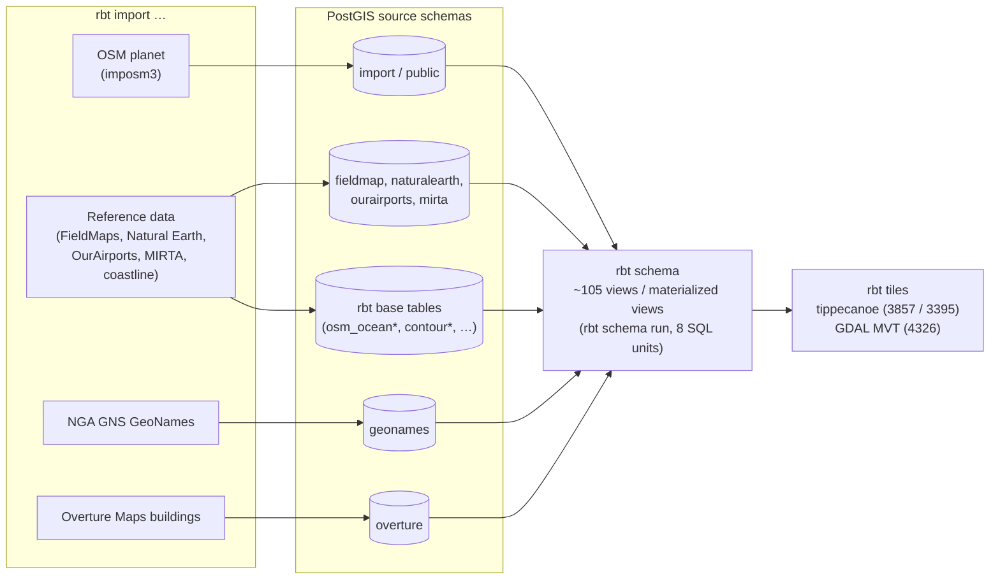
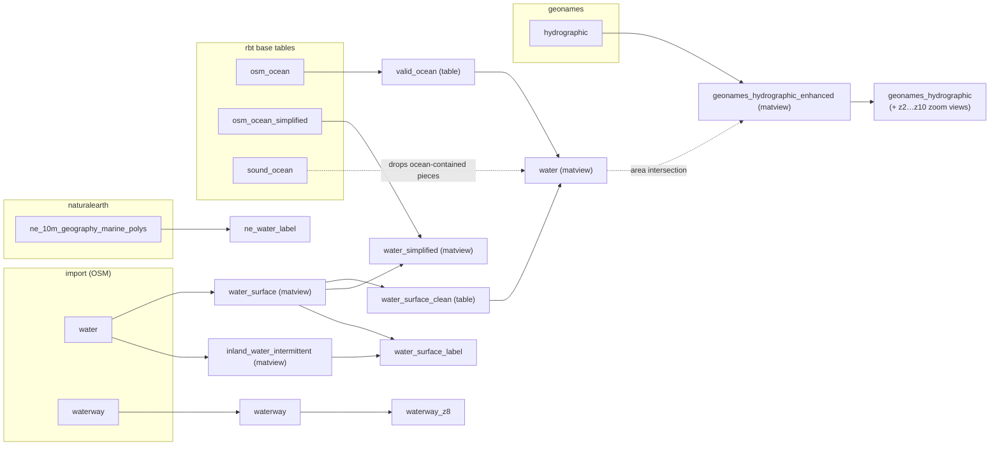
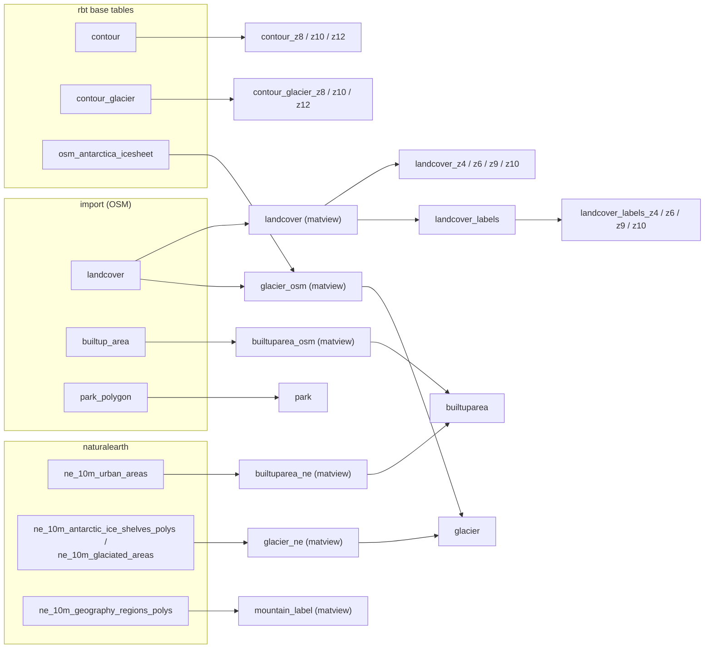
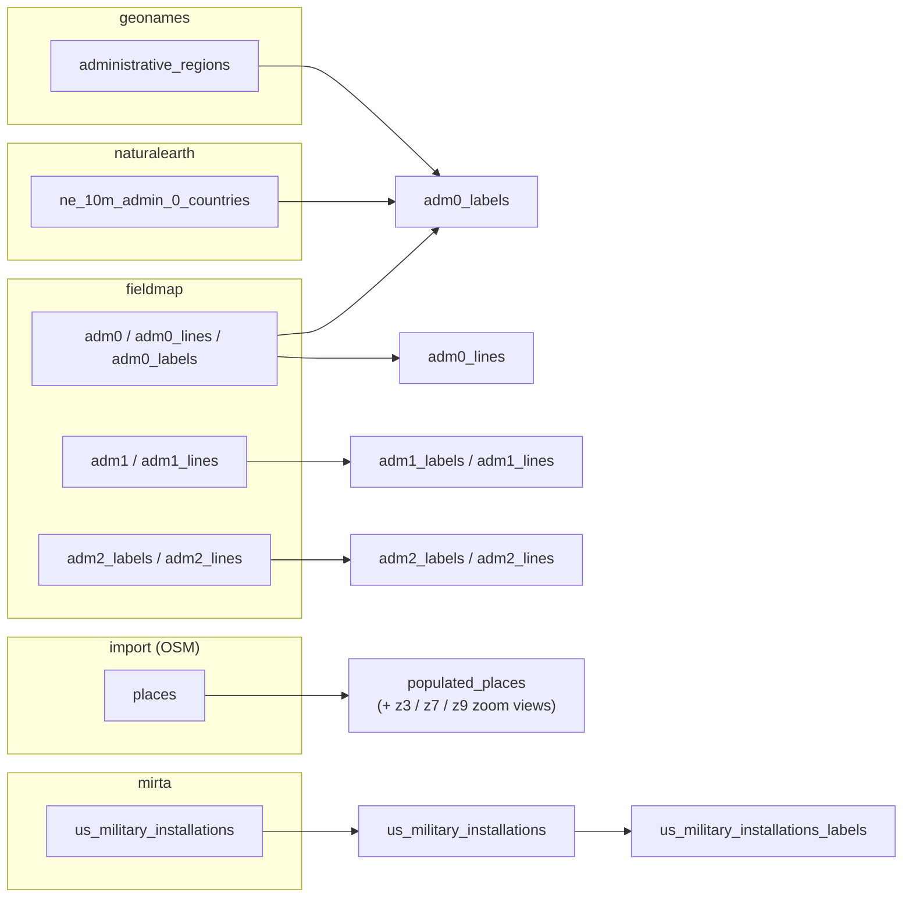
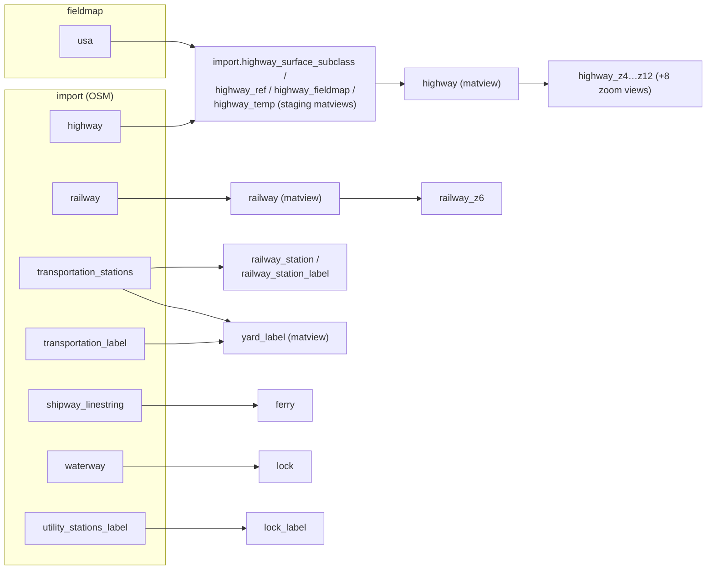
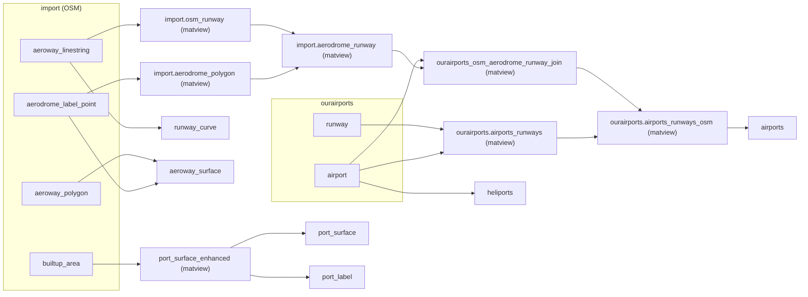
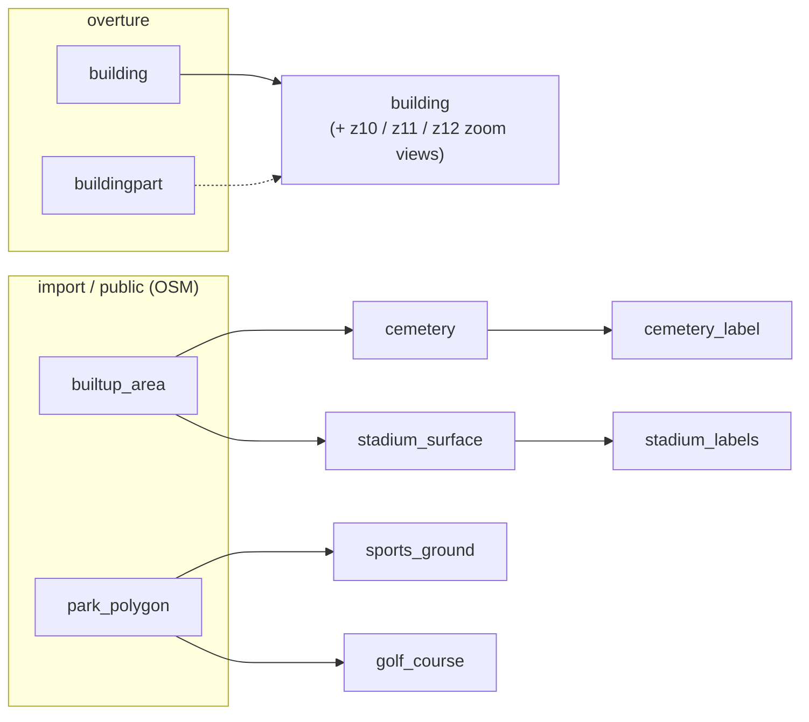
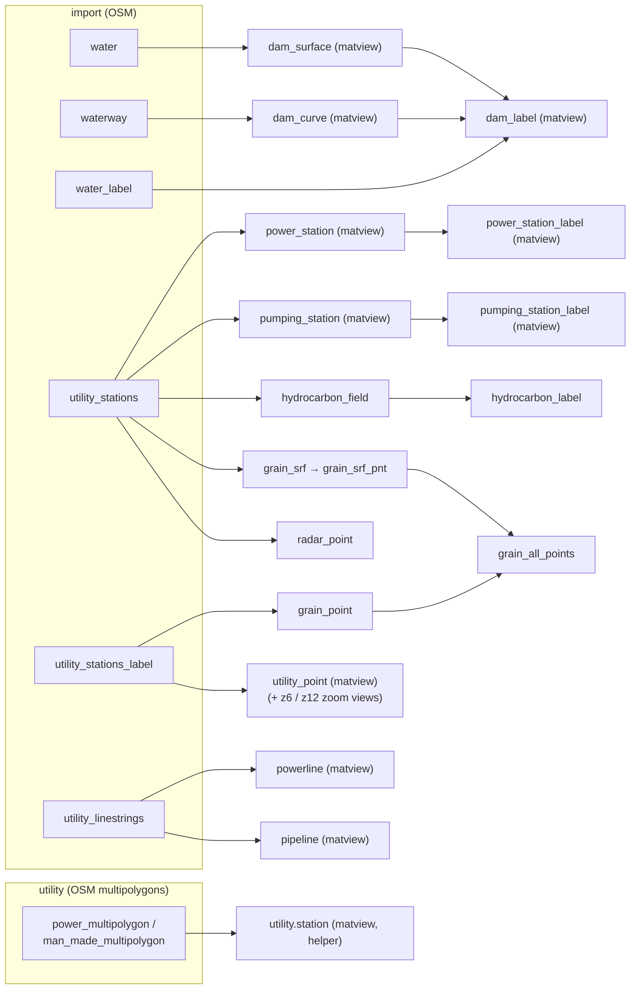

# Database Schema Reference

This page documents the `rbt` schema — the contract between the data importers and the tile
pipeline — and traces every view back to its source tables. All view definitions live in eight
PL/pgSQL files under [`setup/data-sources/schemas/`](https://github.com/MJJ203/rbt-data-generator/tree/main/setup/data-sources/schemas)
and are executed via [`rbt schema run`](cli.md).

## Overview

Importers load raw data into per-source schemas. The schema SQL files then derive roughly **105
views and materialized views** in the `rbt` schema (plus a handful of staging objects in
`import`, `ourairports`, and `utility`). Collapsing zoom-variant families such as
`highway_z4` … `highway_z12` into one logical layer, this surface maps onto the **56 tile layers**
registered in [`config/layers.yml`](configuration.md) (44 cultural, 12 physical).

The non-`rbt` schemas are created by the import scripts (`DATABASE_SCHEMAS` in
[`config/rbt.conf`](https://github.com/MJJ203/rbt-data-generator/blob/main/config/rbt.conf) lists `fieldmap mirta naturalearth ourairports rbt
geonames overture`; imposm3 manages `import`/`public` itself):

| Schema | Loaded by | Contents |
|---|---|---|
| `import` / `public` | `rbt import osm` (imposm3) | Thematic OSM tables: `water`, `waterway`, `water_label`, `highway`, `railway`, `landcover`, `builtup_area`, `park_polygon`, `places`, `aeroway_*`, `aerodrome_*`, `transportation_*`, `shipway_linestring`, `utility_stations`, `utility_stations_label`, `utility_linestrings`. imposm3 stages into `import` and deploys to `public`; most views read `import`, a few (`sports_ground`, `golf_course`) read the deployed `public` copies. |
| `fieldmap` | `rbt import reference` | Administrative boundaries: `adm0`/`adm1`/`adm2` polygons plus `*_lines`/`*_labels`, and the `usa` country mask used for highway enrichment. |
| `naturalearth` | `rbt import reference` | Natural Earth 1:10m reference layers (`ne_10m_urban_areas`, `ne_10m_admin_0_countries`, `ne_10m_glaciated_areas`, `ne_10m_antarctic_ice_shelves_polys`, `ne_10m_geography_marine_polys`, `ne_10m_geography_regions_polys`, …). |
| `ourairports` | `rbt import reference` | `airport` and `runway` CSV imports (plus derived `airports_runways*` materialized views built by the schema scripts). |
| `geonames` | `rbt import geonames` | NGA GNS name layers: `hydrographic`, `administrative_regions`, and friends. |
| `mirta` | `rbt import reference` | `us_military_installations` (US DoD MIRTA geodatabase). |
| `overture` | `rbt import buildings` | `building` and `buildingpart` footprints from Overture Maps GeoParquet. |
| `rbt` (base tables) | `rbt import reference` + external loads | Pre-loaded inputs the schema scripts expect: `osm_ocean`, `osm_ocean_simplified`, `osm_antarctica_icesheet` (osmdata.openstreetmap.de), plus externally produced `contour`, `contour_glacier` (elevation contours) and the `sound_ocean` helper table. |
| `utility` | external OSM load | `power_multipolygon` and `man_made_multipolygon` helper tables consumed by `utility.station`. |



The eight schema units (see `rbt schema list`):

| Key | SQL file | Builds |
|---|---|---|
| `physical` | `physical/physical-core.sql` | Built-up areas, glaciers, mountain labels, parks |
| `landcover` | `physical/landcover.sql` | Landcover polygons and labels |
| `water` | `physical/water-features.sql` | Water surfaces, waterways, water labels |
| `contour` | `physical/terrain.sql` | Contour and glacier-contour zoom views |
| `cultural` | `cultural/cultural-core.sql` | Boundaries, places, ports, hydrographic names, military, cemeteries, dams, power, pipelines, utilities |
| `highway` | `cultural/transportation.sql` | Road network and zoom views |
| `railway` | `cultural/transportation-railway.sql` | Railways, stations, yards |
| `aero` | `cultural/infrastructure.sql` | Airports, heliports, runways, aeroway surfaces |

!!! note
    The unit *descriptions* in `config/layers.yml` are looser than the file contents — e.g. the
    `aero` unit's description mentions dams/powerlines (which actually live in
    `cultural-core.sql`), and ferries/ports live in `cultural-core.sql`, not
    `transportation.sql`. The tables below reflect the actual `CREATE VIEW` statements.

## Water & hydrography

Defined in `physical/water-features.sql`; the GeoNames hydrographic name views live in
`cultural/cultural-core.sql`. OSM water polygons are classified by the `classify_water_type()`
PL/pgSQL function, cleaned, and split into inland vs. ocean parts using the pre-loaded coastline
tables.



| View | Source | Purpose | Zoom |
|---|---|---|---|
| `rbt.water_surface` (matview) | `import.water` | Classified, simplified permanent water polygons | staging |
| `rbt.water` (matview) | `rbt.water_surface_clean`, `rbt.valid_ocean`, `rbt.sound_ocean` | Combined inland + ocean water; the `water` tile layer | z0–13 (z10+ in 4326; `water_simplified` covers z0–9) |
| `rbt.water_simplified` (matview) | `rbt.water_surface` (area > 5 km²), `rbt.osm_ocean_simplified` | Low-zoom simplified water | z0–9 (4326) |
| `rbt.inland_water_intermittent` (matview) | `import.water` (`intermittent = 't'`) | Seasonal/intermittent water polygons | z8–13 |
| `rbt.water_surface_label` | `rbt.water_surface`, `rbt.inland_water_intermittent` | Point-on-surface labels for named water | label layer |
| `rbt.waterway` → `waterway_z8` | `import.waterway` | Rivers, streams, canals (z8 variant: canal/river/stream only) | z6–13 |
| `rbt.ne_water_label` | `naturalearth.ne_10m_geography_marine_polys` | Marine name points (oceans, seas) | z0–13 |
| `rbt.geonames_hydrographic` (+ `_z2`…`_z10`) | `geonames.hydrographic` joined against `rbt.water` | GNS hydrographic name points, area-thresholded per zoom | z1–13 (zoom family) |

## Terrain & landcover

Defined in `physical/terrain.sql`, `physical/landcover.sql`, and `physical/physical-core.sql`.
Contours are externally generated tables that the `contour` unit wraps in `nth_line` zoom views
(`nth_line = 10/5/2` for z8/z10/z12).



| View | Source | Purpose | Zoom |
|---|---|---|---|
| `rbt.contour_z8/z10/z12` | `rbt.contour` (base table) | Elevation contours filtered by `nth_line` (10/5/2) | z9–13 (z8/z10/z12 windows in 4326) |
| `rbt.contour_glacier_z8/z10/z12` | `rbt.contour_glacier` | Glacier contours, same `nth_line` scheme | z9–13 |
| `rbt.landcover` (matview) | `import.landcover` | Leaf type/cycle + wetland classification, multipolygon dump | z3–13 |
| `rbt.landcover_z4/z6/z9/z10` | `rbt.landcover` | Area/subclass-thresholded zoom variants | z4–13 (zoom family) |
| `rbt.landcover_labels` (+ `_z4/_z6/_z9/_z10`) | `rbt.landcover` | Point-on-surface labels for named landcover | z5–13 |
| `rbt.builtuparea` | `rbt.builtuparea_ne` ∪ `rbt.builtuparea_osm` | Urban footprints — Natural Earth at low zoom, OSM at high zoom | z3–13 (NE z3–8, OSM z8–13 in 4326) |
| `rbt.glacier` | `rbt.glacier_ne` ∪ `rbt.glacier_osm` | Glaciated areas + Antarctic ice (NE z0–7, OSM z7–13 in 4326) | z3–13 |
| `rbt.mountain_label` (matview) | `naturalearth.ne_10m_geography_regions_polys` | Mountain-range label lines via `CG_ApproximateMedialAxis` | z6–13 |
| `rbt.park` | `import.park_polygon` | Parks and protected areas | z3–13 |

## Boundaries & places

Defined in `cultural/cultural-core.sql`. Country labels enrich FieldMaps geometry with GNS and
Natural Earth name attributes; lower admin levels pass FieldMaps through directly.



| View | Source | Purpose | Zoom |
|---|---|---|---|
| `rbt.adm0_labels` | `fieldmap.adm0_labels` ⋈ `geonames.administrative_regions` ⋈ `naturalearth.ne_10m_admin_0_countries` ⋈ `fieldmap.adm0` | Country label points with GNS/NE name variants and area | z0–13 |
| `rbt.adm0_lines` | `fieldmap.adm0_lines` | International boundary lines | z0–13 |
| `rbt.adm1_labels` / `adm1_lines` | `fieldmap.adm1` / `adm1_lines` | State/province labels (point-on-surface) and lines | z3–13 |
| `rbt.adm2_labels` / `adm2_lines` | `fieldmap.adm2_labels` / `adm2_lines` | County/district labels and lines | z6–13 |
| `rbt.populated_places` (+ `_z3/_z7/_z9`) | `import.places` | City/town/village/hamlet points, rank-filtered per zoom (rank < 8 / 11 / 12 / all) | z3–13 (zoom family) |
| `rbt.us_military_installations` (+ `_labels`) | `mirta.us_military_installations` | US military installation polygons and label points | z6–13 |

## Transportation

Defined in `cultural/transportation.sql` (roads) and `cultural/transportation-railway.sql`
(rail); ferries and locks come from `cultural/cultural-core.sql`. The highway build runs through
four staging materialized views in `import` before producing `rbt.highway`.



| View | Source | Purpose | Zoom |
|---|---|---|---|
| `rbt.highway` (matview) | `import.highway_temp` (from `import.highway` + `fieldmap.usa`) | Roads with US route typing, lifecycle, surface, lanes | z6–13 |
| `rbt.highway_z4` … `highway_z12` | `rbt.highway` | Subclass-filtered zoom family (motorway/trunk at z4 → residential at z12) | z4–13 (8 variants) |
| `rbt.railway` (matview) | `import.railway` | Gauge/electrification/track/lifecycle classification with `dps_type` styling key | z6–13 |
| `rbt.railway_z6` | `rbt.railway` | Excludes yard service tracks (full `railway` takes over at z13) | z6–13 |
| `rbt.railway_station` / `_label` | `import.transportation_stations` | Station polygons and label points | z10–13 (z9/z11 in 4326) |
| `rbt.yard_label` (matview) | `import.transportation_label` ∪ `import.transportation_stations` | Rail-yard labels with normalized yard size | z10–13 |
| `rbt.ferry` | `import.shipway_linestring` | Ferry routes | z4–13 |
| `rbt.lock` / `lock_label` | `import.waterway` / `import.utility_stations_label` | Canal locks and gates | z10–13 (z11+ in 4326) |

## Aviation & ports

Aviation is `cultural/infrastructure.sql` (schema unit `aero`); ports are built in
`cultural/cultural-core.sql`. The airports pipeline reconciles OurAirports records with OSM
aerodrome polygons and runways through a chain of staging materialized views, then classifies
each airport into a display `category` by area and runway mix.



| View | Source | Purpose | Zoom |
|---|---|---|---|
| `rbt.airports` | `ourairports.airports_runways_osm` (OurAirports ⋈ OSM aerodromes/runways) | One point per airport with standardized runway surface, counts, category/rank; heliports excluded | z5–13 |
| `rbt.heliports` | `ourairports.airport` | Heliports/closed heliports with hospital flag and rank | z5–13 |
| `rbt.runway_curve` | `import.aeroway_linestring` | Runway/taxiway centerlines | z8–13 |
| `rbt.aeroway_surface` | `import.aerodrome_label_point` (non-points) ∪ `import.aeroway_polygon` | Aerodrome and apron polygons | z8–13 |
| `rbt.port_surface_enhanced` (matview) | `import.builtup_area` (port/harbour/industrial-port) | Clustered, deduplicated port polygons with rank/overlap flags | staging |
| `rbt.port_surface` / `port_label` | `rbt.port_surface_enhanced` | Compatibility wrapper and point-on-surface labels | z6–13 (z7+ in 4326) |

## Buildings & land use

Defined in `cultural/cultural-core.sql` (cemeteries, stadiums, sports) with building footprints
from the Overture import.

!!! warning "Building views are currently commented out"
    The `rbt.building` table and `building_z10/z11/z12` zoom views (from `overture.building`,
    area thresholds 5000/2500/1500 m²) are present in `cultural-core.sql` **as commented-out
    DDL**, while `config/layers.yml` still registers `rbt.building*` as tile sources. Until the
    DDL is re-enabled, building tiles rely on a pre-existing `rbt.building` table or on the
    [DuckDB export path](duckdb-buildings.md), which applies the same zoom/area thresholds.



| View | Source | Purpose | Zoom |
|---|---|---|---|
| `rbt.building` (+ `_z10/_z11/_z12`) | `overture.building` (+ `buildingpart`) | Building footprints, area-thresholded per zoom (≥ 5000/2500/1500 m²) | z10–13 (zoom family) |
| `rbt.cemetery` | `import.builtup_area` (cemetery/graveyard subclasses) | Deduplicated cemetery polygons with religion/denomination | z8–13 |
| `rbt.cemetery_label` | `rbt.cemetery` | Labels for named or religious cemeteries | z8–13 |
| `rbt.stadium_surface` / `stadium_labels` | `import.builtup_area` (`sports_centre`, `stadium`) | Stadium polygons and label points | z10–13 (z7+ in 4326) |
| `rbt.sports_ground` | `public.park_polygon` (`pitch`) | Sports pitches | not yet a registered tile layer |
| `rbt.golf_course` | `public.park_polygon` (`golf_course`) | Golf courses | not yet a registered tile layer |

## Infrastructure & utilities

Defined in `cultural/cultural-core.sql`: dams, power, pipelines, hydrocarbon fields, grain
storage, radar, and the generic utility-point family.



| View | Source | Purpose | Zoom |
|---|---|---|---|
| `rbt.dam_curve` (matview) | `import.waterway` (dam/weir) | Dam crest lines with hard/loose surface classification | z8–13 (z7+ in 4326) |
| `rbt.dam_surface` (matview) | `import.water` (dam/weir) | Dam surface polygons | z8–13 |
| `rbt.dam_label` (matview) | `import.water_label` + intersections with `rbt.water`/`waterway`/`dam_*` | Dam labels, supplemented with synthetic points for unlabeled dams | z8–13 |
| `rbt.power_station` / `_label` (matviews) | `import.utility_stations` (`class = 'power'`) | Generation/distribution facilities and label points | z10–13 (z8/z9 in 4326) |
| `rbt.pumping_station` / `_label` (matviews) | `import.utility_stations` (`class != 'power'`) | Pumping/treatment facilities | z10–13 |
| `rbt.hydrocarbon_field` / `_label` | `import.utility_stations` (oil/wellsite/refinery + trigram name matching) | Oil and gas infrastructure, classified into terminal/refinery/field | z6–13 |
| `rbt.grain_srf` / `grain_srf_pnt` / `grain_point` / `grain_all_points` | `import.utility_stations` (+ `_label`) | Grain silo polygons and points | z10–13 (z8+ in 4326) |
| `rbt.powerline` (matview) | `import.utility_linestrings` (power subclasses) | Transmission lines and cables | z8–13 (z9+ in 4326) |
| `rbt.pipeline` (matview) | `import.utility_linestrings` (man_made/pipeline/seamark) | Pipelines for oil, gas, water | z6–13 (z9+ in 4326) |
| `rbt.utility_point` (matview, + `_z6`/`_z12`) | `import.utility_stations_label` | Towers, masts, tanks, platforms etc.; zoom variants progressively re-admit poles/towers | z6–13 (zoom family) |
| `rbt.radar_point` | `import.utility_stations` (`tower_type = 'radar'`) | Radar towers | z8–13 (z7+ in 4326) |
| `utility.station` (matview) | `utility.power_multipolygon` ∪ `utility.man_made_multipolygon` | Deduplicated station helper (not a tile layer) | helper |

## Regenerating the schema

All views are derived data — re-running the SQL never touches the imported source tables, so the
schema units can be re-executed at any time after an import or an OSM update:

=== "rbt CLI"

    ```bash
    # List the registered units
    rbt schema list

    # Run everything
    rbt schema run --all

    # Run a single unit, or several
    rbt schema run water
    rbt schema run highway railway aero

    # Run every unit of one layer type
    rbt schema run --type physical

    # Preview the psql invocations without executing
    rbt schema run --all --dry-run
    ```

=== "Direct psql"

    ```bash
    cd setup/data-sources/schemas/physical
    psql -v ON_ERROR_STOP=1 -f water-features.sql
    ```

Each unit is dispatched as `psql -v ON_ERROR_STOP=1 -f <file>` with the SQL file's directory as
the working directory; output is teed to `schema_<key>_<timestamp>.log` in the shared log
directory.

!!! note "Idempotency"
    Regular views are recreated with `DROP VIEW IF EXISTS … CASCADE` followed by `CREATE VIEW`.
    Materialized views are either dropped up front for a clean rebuild (e.g.
    `port_surface_enhanced`) or guarded with `CREATE MATERIALIZED VIEW IF NOT EXISTS` — those
    are *not* rebuilt on re-run; use `REFRESH MATERIALIZED VIEW` or drop them first to pick up
    new data. The scripts commit in checkpoints, so views that succeed are preserved even if a
    later step fails.

## Related Documentation

- **[Database Initialization](database-initialization.md)** — loading the source schemas
- **[Configuration Reference](configuration.md)** — `config/rbt.conf` and `config/layers.yml`
- **[Physical Layers](physical-layers.md)** / **[Cultural Layers](cultural-layers.md)** — tile generation per theme
- **[rbt CLI](cli.md)** — full command reference
