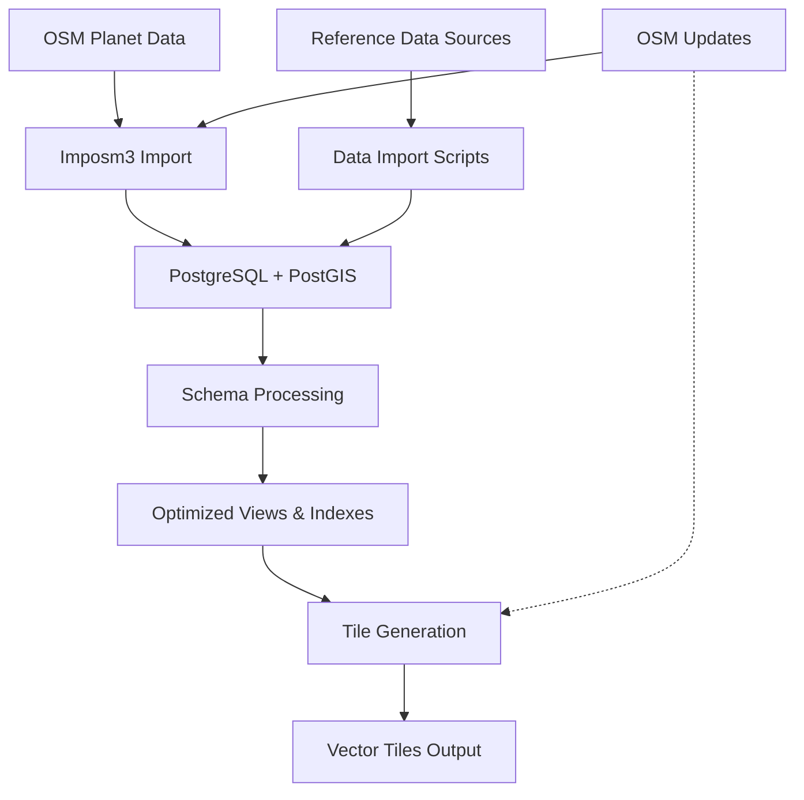

# Getting Started with RBT Vector Tiles

This guide will walk you through setting up and running RBT Vector Tiles for the first time.

## 📋 Prerequisites

### System Requirements

**Minimum Configuration**:
- 16 CPU cores
- 32GB RAM  
- 100GB available disk space
- Ubuntu 20.04+ or macOS 10.15+

**Recommended Configuration**:
- 32 CPU cores
- 128GB RAM
- 1TB NVMe SSD
- Dedicated PostgreSQL server

### Required Software

1. **PostgreSQL 17+** with PostGIS 3.5+
2. **GDAL/OGR 3.10+** with MVT and FlatGeoBuf drivers
3. **Imposm3** (latest version)
4. **Tippecanoe** (latest version)
5. **Node.js 22+** (for some utilities)

### Installation on Ubuntu

```bash
# PostgreSQL and PostGIS
sudo apt update
sudo apt install postgresql-17 postgresql-17-postgis-3

# GDAL/OGR
sudo apt install gdal-bin python3-gdal

# Install Imposm3
wget https://github.com/omniscale/imposm3/releases/download/v0.11.1/imposm-0.11.1-linux-x86-64.tar.gz
tar xzf imposm-0.11.1-linux-x86-64.tar.gz
sudo mv imposm-0.11.1-linux-x86-64/imposm /usr/local/bin/

# Install Tippecanoe
git clone https://github.com/felt/tippecanoe.git
cd tippecanoe
make -j$(nproc)
sudo make install
```

### Installation on macOS

```bash
# Using Homebrew
brew install postgresql@17 postgis gdal imposm tippecanoe
```

## 🚀 Step-by-Step Setup

### Step 1: Clone and Configure

```bash
# Clone the repository
git clone https://github.com/your-org/rbt-vector-tiles.git
cd rbt-vector-tiles

# Copy environment template (optional)
cp env.example .env
```

### Step 2: Configure Environment

**Option 1: Centralized Configuration (Recommended)**

Edit the main configuration file `config/rbt.conf`:

```bash
# Database connection settings
DATABASE_HOST=localhost
DATABASE_USER=postgres
DATABASE_PASSWORD=your_secure_password
DATABASE_NAME=rbt

# Processing settings (adjust based on your hardware)
MAX_PARALLEL_JOBS=4
LOG_LEVEL=INFO
DEFAULT_PROJECTION=3857

# Resource settings
DISK_SPACE_REQUIRED_GB=100
MEMORY_REQUIRED_GB=16
```

**Option 2: Environment Variables (Backward Compatible)**

Edit `.env` file or set environment variables:

```bash
# Database connection (legacy variable names still supported)
PG_HOST=localhost
PG_USR=postgres
PG_PASS=your_secure_password
PG_DATABASE=rbt

# Processing settings
MAX_PARALLEL_JOBS=4
LOG_LEVEL=INFO
```

> **💡 Configuration Priority**: Environment variables override `config/rbt.conf`, which overrides script defaults. The centralized config provides consistency while maintaining flexibility.

### Step 3: Validate Environment

```bash
./tools/validate-environment.sh
```

This will check:
- ✅ All required tools are installed
- ✅ Database connection works
- ✅ Sufficient disk space and memory
- ✅ Project structure is correct

### Step 4: Initialize Database

```bash
./setup/init-database.sh
```

This one-time process will:
1. **Download OSM planet data** (~55GB, 1-3 hours)
2. **Import OSM data** using Imposm3 (2-6 hours)
3. **Import reference datasets** (1-2 hours):
   - FieldMaps administrative boundaries
   - Natural Earth cartographic data
   - GeoNames geographic names
   - Overture Maps building footprints
   - Aviation data from OurAirports
4. **Process database schemas** (30-60 minutes)

**Total time**: 6-12 hours depending on hardware and internet speed.

### Step 5: Start Production Operations

#### Start Continuous OSM Updates

```bash
# Start in background
nohup ./production/update-osm.sh run > osm-updates.log 2>&1 &

# Check status
./production/update-osm.sh status
```

#### Generate Vector Tiles

```bash
# Generate all tiles in all projections
./production/generate-tiles.sh --all

# Or generate specific combinations
./production/generate-tiles.sh --layer-type physical --projection 3857
./production/generate-tiles.sh --layer-type cultural --projection 4326
```

## 🎯 Understanding the Workflow

### One-Time Setup vs. Continuous Operations

RBT Vector Tiles has two distinct phases:

#### 1. **Setup Phase** (Run Once)
- Database initialization
- Data source imports
- Schema processing

#### 2. **Production Phase** (Run Continuously)
- OSM data updates (background service)
- Vector tile generation (on-demand or scheduled)

### Data Flow



## 📊 Monitoring and Maintenance

### Health Checks

```bash
# Check system status
./tools/validate-environment.sh
```

### Log Monitoring

Logs are stored in `output/logs/`:
- `database_init_*.log` - Database initialization
- `tile_generation_*.log` - Tile generation
- `osm_updates_*.log` - OSM updates

## 🐳 Docker Deployment

### Quick Start with Docker

```bash
# Step 1: Initial setup (one-time database initialization)
docker-compose --profile setup up rbt-setup

# Step 2: Start production services (OSM updates + tile generation)
docker-compose --profile production up -d

# Step 3 (Optional): Start with tile server for serving generated tiles
docker-compose --profile production --profile serve up -d

# Generate tiles manually
docker-compose exec rbt-tiles ./production/generate-tiles.sh --all

# Check OSM update status
docker-compose exec rbt-osm-updates ./production/update-osm.sh status
```

### Docker Configuration

Edit environment variables in your `.env` file or `config/rbt.conf` before starting:

```bash
# Database settings
PG_USR=rbt_user
PG_PASS=rbt_password  
PG_DATABASE=rbt

# Processing settings
MAX_PARALLEL_JOBS=4
LOG_LEVEL=INFO
```

## 🔍 Troubleshooting

### Common Issues

**Database connection errors**:
```bash
# Check connection
./tools/validate-environment.sh

# Test manually
psql "host=$PG_HOST dbname=rbt user=$PG_USR password=$PG_PASS" -c "SELECT version();"
```

**Insufficient resources**:
- Reduce `MAX_PARALLEL_JOBS` in `config/rbt.conf` or via environment variable
- Increase PostgreSQL memory settings
- Ensure sufficient disk space

**Tile generation failures**:
```bash
# Run with verbose logging
./production/generate-tiles.sh --verbose --dry-run
```

## 📚 Next Steps

### Continue with Documentation

- **[🏗️ Architecture Overview](architecture.md)** - System design, data flow, and deployment architecture
- **[🌍 Physical Layers](physical-layers.md)** - Terrain, hydrology, land cover processing
- **[🏙️ Cultural Layers](cultural-layers.md)** - Transportation, buildings, infrastructure processing
- **[🗄️ Database Initialization](database-initialization.md)** - Detailed database setup process
- **[📥 OSM Import Pipeline](osm-import.md)** - OpenStreetMap data processing workflow

### Additional Resources

- **[Setup Guide](setup-readme.md)** - Detailed setup documentation
- **[Production Guide](production-readme.md)** - Continuous operations documentation
- **[DuckDB Buildings Export](duckdb-buildings.md)** - Alternative building data processing

### Getting Help

- **Configuration issues**: Check the [troubleshooting section](#troubleshooting) above
- **Performance problems**: Review the system requirements and resource allocation
- **Data issues**: Consult the layer-specific documentation for processing details
