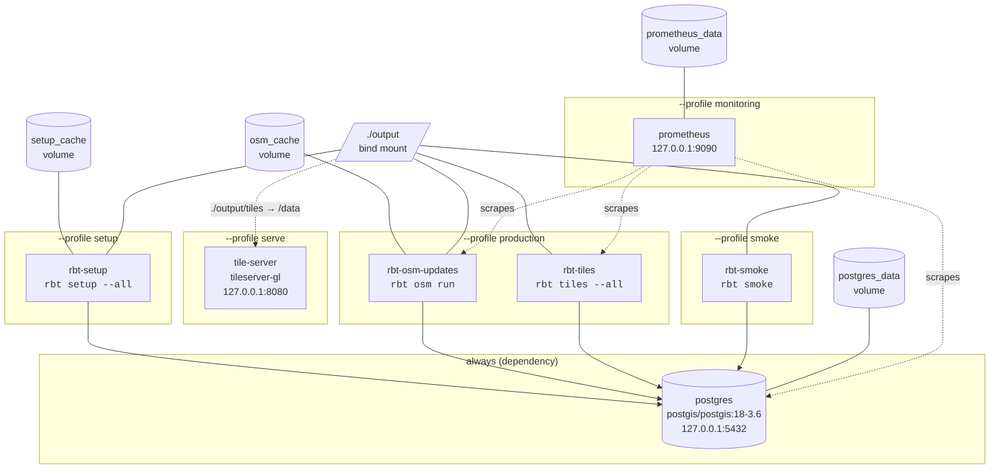

# Operations Guide

The day-2 runbook for RBT Vector Tiles: which Compose profile to start for
each scenario, how the OSM update daemon behaves, how to regenerate tiles,
where outputs land, and how to keep the system healthy. For first-time setup
see the [Getting Started Tutorial](getting-started.md); for design rationale
see the [Architecture](architecture.md) document.

Every operation dispatches through the `rbt` CLI ([reference](cli.md)) — the
same commands work on a host install (`uv run rbt …`) and inside the
containers, where they are the Compose `command:` entries.

## Compose Topology

One multi-stage image (`Dockerfile.production`, tagged `rbt-vector-tiles:latest`)
backs all `rbt-*` services; the Compose `command:` selects the role. `postgres`
has no profile — it starts automatically as a health-checked dependency of
whichever profile you activate.



| Service | Profile | Command | Ports (localhost only) | Storage |
|---|---|---|---|---|
| `postgres` | *(none — auto-started)* | PostGIS 18-3.6, `-c config_file=...` | `127.0.0.1:5432` | `postgres_data` volume, `config/postgresql.conf` mounted read-only and loaded via a `command:` override |
| `rbt-setup` | `setup` | `rbt setup --all` | — | `./output` bind, `setup_cache` volume |
| `rbt-osm-updates` | `production` | `rbt osm run` | — | `./output` bind, `osm_cache` volume |
| `rbt-tiles` | `production` | `rbt tiles --all` (image default) | — | `./output` bind (`TILE_CACHE_DIR=/app/output/tiles`) |
| `rbt-smoke` | `smoke` | `rbt smoke` | — | `./output` bind |
| `tile-server` | `serve` | tileserver-gl | `127.0.0.1:8080` | `./output/tiles` → `/data`, `config/tile-server.json` → `/data/config.json` |
| `prometheus` | `monitoring` | Prometheus | `127.0.0.1:9090` | `prometheus_data` volume, `config/prometheus.yml` read-only |

## Profile Cookbook

```bash
# Build (or rebuild) the shared image
docker compose build

# One-time database initialization — runs rbt setup --all, then exits.
# Expect many hours for a full planet import.
docker compose --profile setup up rbt-setup

# Continuous production: OSM diff updates + tile generation
docker compose --profile production up -d

# Production with tile serving on http://localhost:8080
docker compose --profile production --profile serve up -d

# End-to-end smoke test (validate → bootstrap → schema → tile dry-runs → DB)
docker compose --profile smoke run --rm rbt-smoke

# Optional Prometheus on http://localhost:9090
docker compose --profile monitoring up -d prometheus

# Stop everything started above (named volumes are preserved)
docker compose --profile production --profile serve down
```

One-off commands run in a disposable container against the same database and
output directory:

```bash
docker compose run --rm rbt-tiles rbt tiles --layer-type physical --projection 3857 --water
docker compose run --rm rbt-tiles rbt validate
docker compose run --rm rbt-tiles rbt schema run --type cultural
```

## Scheduled integration tests

Beyond the per-PR CI jobs, a **nightly workflow**
([`.github/workflows/nightly.yml`](https://github.com/MJJ203/rbt-data-generator/blob/main/.github/workflows/nightly.yml))
exercises the real pipeline end to end on a committed OpenStreetMap extract
of Liechtenstein (`tests/fixtures/liechtenstein-*.osm.pbf`, ~3.4 MB): imposm
imports it into a PostGIS service container, `rbt schema run` builds the
`water`/`landcover`/`highway`/`railway` units (empty reference-table stubs
from `tests/fixtures/seed_reference_stubs.sql` stand in for the non-OSM
sources), and `rbt tiles` generates and verifies output in all three
projections — including tile-join + BTIS consolidation, which no per-PR job
covers.

- **A red `nightly-osm-fixture` job is a real regression** in the import →
  schema → tiles path (or a fixture gone stale) — treat it like a failing PR
  check. Logs are uploaded as a run artifact.
- **A red `upstream-probe` job** means a live data source (OurAirports, NGA
  GNS) changed shape or went unavailable; the job is advisory
  (`continue-on-error`) while it burns in.
- Trigger manually with `gh workflow run nightly.yml`.
- Fixture refresh procedure: see
  [`tests/fixtures/README.md`](https://github.com/MJJ203/rbt-data-generator/blob/main/tests/fixtures/README.md).

The remaining schema units are excluded deliberately: `cultural` and
`contour` cannot run on a fresh import (see the tracked issues referenced in
the fixtures README), and `physical`/`aero` need real reference data — both
are candidates for a phase-2 expansion.

!!! note "Selective setup re-runs"
    `rbt setup` accepts step flags, so a failed initialization can resume
    without repeating the planet import:
    `docker compose run --rm rbt-setup rbt setup --import-reference-data --process-schemas`.

## OSM Update Daemon

`rbt osm run` is the main process of the `rbt-osm-updates` container. It
supervises `imposm run -config setup/data-sources/osm/imposm-config.json`
(override with `OSM_CONFIG_FILE`), which applies daily OSM replication diffs
to the `import.*` tables.

| Command | Behavior |
|---|---|
| `rbt osm run` | Starts the supervisor in the foreground (blocks). Refuses to start if a live pidfile already exists. |
| `rbt osm status` | Exit `0` if running, `1` if not; also reports the last applied change from the `imposm3_log` table. |
| `rbt osm stop` | Sends `SIGTERM` via the pidfile, waits up to 30 s, then escalates to `SIGKILL`. |
| `rbt osm import` | One-shot planet download + initial import (alias of `rbt import osm`; see the [`--stage` table](osm-import.md)). |

Lifecycle details:

- **Pidfile** — `$SHARED_TEMP_DIR/imposm-run.pid`, by default
  `output/temp/imposm-run.pid` (inside containers `/app/output/temp/`, which
  is the same bind-mounted directory).
- **Signals** — the supervisor traps `SIGTERM`/`SIGINT`, forwards a terminate
  to the `imposm` child, and sends `SIGKILL` if it has not exited after a
  30-second grace period. imposm's stdout/stderr are streamed into the `rbt`
  log.
- **Status/stop in containers** — pids are namespaced, so run these inside
  the same container:
  `docker compose exec rbt-osm-updates rbt osm status`.

!!! note "Compose stop grace period"
    `docker-compose.yml` sets `stop_grace_period: 35s` on `rbt-osm-updates`,
    comfortably longer than the supervisor's 30 s SIGTERM→SIGKILL escalation
    window, so `docker compose stop rbt-osm-updates` already gives imposm a
    clean shutdown without extra flags.

## Tile Generation Runbook

=== "Docker Compose"

    ```bash
    # Full regeneration: every layer, every projection
    docker compose run --rm rbt-tiles rbt tiles --all

    # One layer type in one projection
    docker compose run --rm rbt-tiles rbt tiles --layer-type physical --projection 3857

    # A category across projections
    docker compose run --rm rbt-tiles rbt tiles --water --waterway

    # A single layer in a single projection
    docker compose run --rm rbt-tiles rbt tiles layer water --projection 3395
    ```

=== "Host CLI"

    ```bash
    rbt tiles --all
    rbt tiles --layer-type physical --projection 3857
    rbt tiles --water --waterway
    rbt tiles layer water --projection 3395
    ```

Useful switches (see `rbt tiles --help` for the full list):

- `--dry-run` prints every command without executing — cheap to sanity-check
  a selection before an hours-long run.
- `--no-tile-join` keeps per-layer MBTiles instead of merging them into
  `<type>_<projection>.mbtiles`; `--no-btis` skips the BTIS metadata pass.
- `--layer KEY` (repeatable) selects layers by registry key; `rbt layers list`
  shows the keys.

!!! warning "Always `--force` after a schema refresh"
    The 3857/3395 pipeline caches its `ogr2ogr` exports as `.fgb` files next
    to the tiles and **reuses them on the next run** (a `REUSING cached
    export` warning is logged). After `rbt schema run` or any database
    refresh, regenerate with `rbt tiles --force` — otherwise the new views
    are silently ignored and the tiles stay stale.

!!! note "Native engine only"
    Tile generation is fully native Python; the legacy bash generators were
    removed after the [parity runbook](parity-runbook.md) verification
    confirmed output parity on real data.

## Serving Tiles

The `serve` profile runs [TileServer-GL](https://github.com/maptiler/tileserver-gl)
on `http://localhost:8080`, with `./output/tiles` mounted at `/data` and
`config/tile-server.json` as its configuration. The shipped config registers
the two merged Web-Mercator tilesets:

| Source id | MBTiles path (relative to `output/tiles/`) |
|---|---|
| `physical-3857` | `physical/3857/physical_3857.mbtiles` |
| `cultural-3857` | `cultural/3857/cultural_3857.mbtiles` |

Tile generation writes to `TILE_CACHE_DIR` (default `output/tiles/`) in a
`<layer-type>/<projection>/` layout:

```
output/tiles/
├── physical/
│   ├── 3857/
│   │   ├── water_3857.fgb            # cached ogr2ogr export (intermediate)
│   │   ├── water_3857.mbtiles        # per-layer tiles
│   │   ├── water_3857.log            # per-layer export + tippecanoe log
│   │   ├── physical_3857.mbtiles     # tile-join merge (+ BTIS metadata)
│   │   └── merge_3857.log
│   ├── 3395/                         # same shape as 3857
│   └── 4326/
│       ├── physical_tiles/           # tile DIRECTORY: {z}/{x}/{y}.pbf
│       │   └── metadata.json
│       └── physical_4326_mvt.log
└── cultural/                         # same shape; 4326 dataset is cultural_tiles/
```

!!! note "EPSG:4326 produces a directory, not MBTiles"
    The 4326 backend (GDAL's MVT driver) writes a `{z}/{x}/{y}.pbf` tree plus
    `metadata.json` — there is no `.mbtiles` file, and each run replaces the
    whole directory. TileServer-GL's `mbtiles` sources cannot point at it;
    serve the directory with any static file server (or MapProxy), e.g.
    `python3 -m http.server -d output/tiles/physical/4326/physical_tiles`.

To serve 3395 output or additional per-layer MBTiles, add entries to the
`data` block of `config/tile-server.json` and restart the `tile-server`
service.

## Monitoring & Health

Three native checks, all exposed as CLI commands (`src/rbt/checks.py`):

| Command | Purpose | Used by |
|---|---|---|
| `rbt health` | Fast liveness probe: `SELECT 1` round-trip plus PATH warnings for `tippecanoe`/`imposm`. | Docker `HEALTHCHECK` in every `rbt-*` container (30 s interval, 10 s timeout, 3 retries). |
| `rbt validate` | Pre-flight: config values, required tools, database/extensions/schemas, disk, memory, project structure. | Operators, CI, first step of `rbt smoke`. |
| `rbt smoke` | End-to-end sanity: validate → bootstrap → schema unit → tile dry-runs → DB round-trip. | `rbt-smoke` service / `smoke` profile. |

Container health is visible in `docker compose ps`; a failing `rbt health`
marks the container `unhealthy`.

The `monitoring` profile starts Prometheus (`config/prometheus.yml`, 30 s
scrape interval) with jobs for `rbt-tiles:8080/metrics`,
`rbt-osm-updates:8080/metrics`, and `postgres:9187`. These are pre-wired
scrape targets: the `rbt` containers do not export metrics themselves yet,
and the `postgres` job expects a
[postgres_exporter](https://github.com/prometheus-community/postgres_exporter)
sidecar that is not part of the Compose file — add one if you need database
metrics.

### Log locations

All `rbt` logs land under `SHARED_LOG_DIR` (default `output/logs/`, bind-mounted
into every container):

| File | Source |
|---|---|
| `output/logs/rbt_<timestamp>.log` | Default per-invocation log for mutating `rbt` commands (`--log-file` overrides, `--no-log-file` disables). |
| `output/logs/schema_<key>_<timestamp>.log` | `psql` output of each `rbt schema run` unit. |
| `output/logs/<importer>_<job>_<timestamp>.log` | Per-job importer logs (one file per download/ingest job). |
| `output/tiles/<type>/<proj>/*.log` | Per-layer export/tippecanoe logs, `merge_<proj>.log`, `<type>_4326_mvt.log`. |
| `docker compose logs postgres` (stderr) | PostgreSQL server logs. `config/postgresql.conf` intentionally leaves `logging_collector` off (no writable `log_directory` is provisioned), so logs go to stderr and are captured by the container's log driver rather than rotated files under `/var/log/postgresql/`. |

## Maintenance

### Refreshing the `rbt.*` views

The schema SQL units drop and recreate their views and materialized views, so
"refresh" means re-running the unit and then regenerating tiles with `--force`:

```bash
rbt schema list                      # the 8 registered units and their SQL files
rbt schema run water contour         # selected units
rbt schema run --type cultural       # everything for one layer type
rbt schema run --all                 # all units
rbt tiles --force ...                # then bypass the .fgb cache
```

Each unit runs via `psql -v ON_ERROR_STOP=1`, so a failing statement aborts
that unit with a non-zero exit — check
`output/logs/schema_<key>_<timestamp>.log`.

### Vacuuming

`config/postgresql.conf` configures aggressive autovacuum (4 workers, 15 s
naptime) specifically for the high-churn `import.*` tables that the OSM diff
stream rewrites. Manual maintenance is worthwhile after the initial planet
import or a bulk re-import:

```bash
docker compose exec postgres vacuumdb -U rbt_user -d rbt --analyze
# or targeted:
docker compose exec postgres psql -U rbt_user -d rbt -c "VACUUM ANALYZE import.highway;"
```

### Disk cleanup

| Path | What accumulates | Safe to remove? |
|---|---|---|
| `output/tiles/**/*.fgb` | Cached FlatGeoBuf exports (3857/3395 intermediates). | Yes — they are re-exported on the next run (equivalent to `--force`). Keep them if you want fast tippecanoe-only re-runs. |
| `output/temp/` | Shared scratch (`SHARED_TEMP_DIR`). | Yes, **except** `imposm-run.pid` while `rbt osm run` is active. |
| `/tmp/tiles` (`TILE_TEMP_DIR`) | tippecanoe sort scratch; sized by the largest layer. | Yes, between runs. |
| `output/logs/` | Timestamped run logs (never auto-rotated). | Yes — e.g. `find output/logs -name '*.log' -mtime +30 -delete`. |
| `output/tiles-bash/` | Side-by-side output from [parity runs](parity-runbook.md). | Yes, once the comparison is recorded. |

Named volumes (`postgres_data`, `setup_cache`, `osm_cache`, `prometheus_data`)
survive `docker compose down`; reclaim them only with
`docker compose down -v` — which deletes the database.

## Related Documentation

- [Architecture](architecture.md) — system design and orchestration rules
- [`rbt` CLI Reference](cli.md) — full command surface
- [Configuration Reference](configuration.md) — `rbt.conf` and environment variables
- [Performance & Sizing](performance.md) — hardware profiles and PostgreSQL tuning
- [Troubleshooting](troubleshooting.md) — failure scenarios and fixes
- [Parity Runbook](parity-runbook.md) — retiring the deprecated bash tile path
