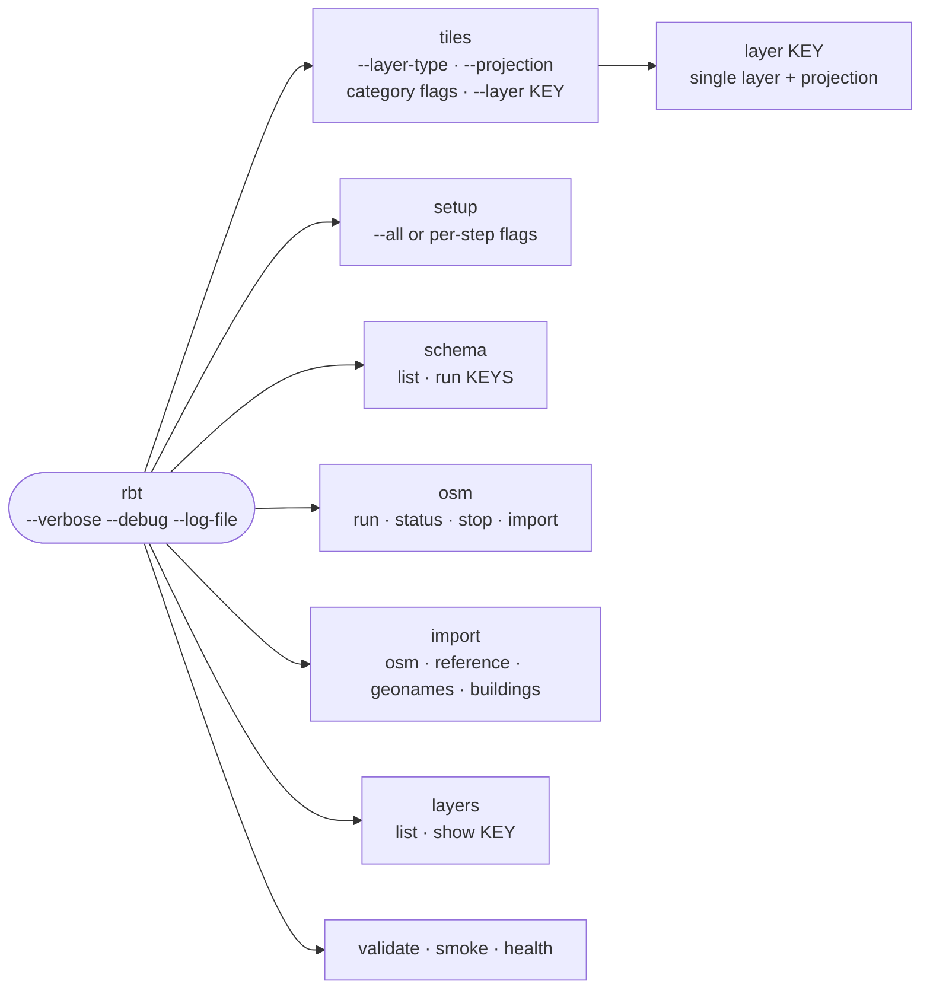

# Project Tour

A guided tour of the repository for your first week. It covers the annotated
layout, where each concern lives, the boundary between the Python CLI and the
external tools it drives, and a suggested reading order.

The one-sentence summary: **declarative configuration in `config/`, all
orchestration and data loading in `src/rbt/`, imposm configs + schema SQL in
`setup/data-sources/`, artifacts in `output/`.**

## Repository layout

```
rbt-data-generator/
├── config/
│   ├── rbt.conf                 # Central shell-style KEY=VALUE config (parsed by Python)
│   ├── layers.yml               # Declarative layer registry — the heart of tile generation
│   ├── postgresql.conf          # Tuned PostgreSQL 18 config, mounted by docker-compose
│   ├── tile-server.json         # TileServer-GL config for the `serve` profile
│   └── prometheus.yml           # Prometheus scrape config for the `monitoring` profile
├── src/rbt/                     # The `rbt` CLI — the ONLY orchestrator
│   ├── cli.py                   # Thin Typer app assembler: global options + mounts commands/
│   ├── commands/                # One module per command group (thin Typer wiring; logic lives elsewhere)
│   │   ├── tiles.py             # `rbt tiles` — TileRequest normalization + native engine dispatch
│   │   ├── setup.py             # `rbt setup` — bootstrap + import + schema orchestration
│   │   ├── importers.py         # `rbt import osm|reference|geonames|buildings`
│   │   ├── osm.py               # `rbt osm run|status|stop` (+ `rbt osm import`, alias of `rbt import osm`)
│   │   ├── schema.py            # `rbt schema run|list`
│   │   ├── layers.py            # `rbt layers list|show`
│   │   ├── checks.py            # `rbt validate|health|smoke`
│   │   └── _common.py           # Shared Typer option/enum plumbing
│   ├── config.py                # Frozen Settings dataclass + load_settings()
│   ├── layers.py                # layers.yml loader → Layer / LayerRegistry / MvtConfig (+ LayerRegistryError)
│   ├── paths.py                 # project_root() discovery (RBT_PROJECT_ROOT, then walk up)
│   ├── logging.py               # Rich console logging + optional file tee
│   ├── process.py               # run() / run_with_retry() subprocess helpers (dry-run aware)
│   ├── setup_db.py              # CREATE DATABASE / EXTENSIONS bootstrap + `rbt setup` steps
│   ├── schema.py                # Dispatches schema SQL via psql -v ON_ERROR_STOP=1
│   ├── checks.py                # rbt validate / smoke / health (native Python)
│   ├── importers/                # Native data importers (declarative registries + job pools)
│   │   ├── _support.py          # Shared toolkit: OgrDataset registry, ogr2ogr builder, retrying pool, downloads
│   │   ├── osm.py               # `rbt import osm` stages + the `rbt osm run|status|stop` supervisor
│   │   ├── reference.py         # `rbt import reference` — FieldMaps/Natural Earth/OurAirports/MIRTA
│   │   ├── geonames.py          # `rbt import geonames` — NGA GNS + USGS GNIS
│   │   └── buildings.py         # `rbt import buildings` — Overture Maps buildings (S3 + ogr2ogr)
│   └── tiles/                   # Tile generation engine
│       ├── engine.py            # TileEngine — picks the backend per projection
│       ├── exporter.py          # ogr2ogr → FlatGeoBuf (3857/3395)
│       ├── tippecanoe.py        # tippecanoe command construction (3857/3395)
│       ├── tile_join.py         # Merges per-layer MBTiles into one file
│       ├── btis.py              # BTIS metadata injection into MBTiles
│       └── gdal_mvt.py          # EPSG:4326 backend (GDAL MVT driver — no tippecanoe)
├── setup/data-sources/          # Importer configuration + SQL schema sources
│   ├── osm/                     # imposm-config.json + imposm-mapping.yaml
│   └── schemas/                 # 8 PL/pgSQL files that create the rbt.* views (run via `rbt schema`)
│       ├── physical/            # physical-core, landcover, water-features, terrain
│       └── cultural/            # cultural-core, transportation, transportation-railway, infrastructure
├── tools/                       # Standalone utilities
│   ├── overture_building_processing.sh  # Wrapper: fetch Overture release → DuckDB export
│   └── duckdb-building-export.sql       # DuckDB SQL: Overture buildings → FlatGeoBuf
├── tests/                       # pytest suite (fake_repo / recorded_run fixtures in conftest.py)
│   └── fixtures/                # Seed SQL + committed Liechtenstein .osm.pbf for the nightly run
├── docs/                        # This MkDocs Material site
├── output/                      # Generated artifacts (gitignored): tiles/, logs/, temp/
├── .github/workflows/           # CI (ruff + mypy + pytest), docs deploy, nightly integration
├── docker-compose.yml           # Profiles: setup / production / serve / smoke / monitoring
├── Dockerfile.production        # Multi-stage image: GDAL + tippecanoe 2.79.0 + imposm 0.14.2 + rbt
├── pyproject.toml               # Python package (`rbt`), ruff / mypy / pytest config
└── mkdocs.yml                   # Documentation build
```

## Where does X live?

### Configuration resolution

There is one configuration file — [`config/rbt.conf`](https://github.com/MJJ203/rbt-data-generator/blob/main/config/rbt.conf) — and
one consumer: **the `rbt` CLI** parses it in
[`src/rbt/config.py`](https://github.com/MJJ203/rbt-data-generator/blob/main/src/rbt/config.py). `load_settings()` builds an
immutable `Settings` dataclass with the precedence **CLI overrides →
environment variables → `config/rbt.conf` → built-in defaults**. The
`${VAR:-default}` fallbacks in the file are collapsed against the current
environment at parse time. Loading settings never mutates `os.environ`;
child processes (psql, ogr2ogr, imposm) receive an explicit
environment from `Settings.subprocess_env()` that bundles the libpq `PG*`,
legacy `PG_*`, and `DATABASE_*` spellings of the same connection.

See the [Configuration Reference](configuration.md) for every variable.

### The layer registry

[`config/layers.yml`](https://github.com/MJJ203/rbt-data-generator/blob/main/config/layers.yml) is the single declarative
definition of what the pipeline produces, parsed by
[`src/rbt/layers.py`](https://github.com/MJJ203/rbt-data-generator/blob/main/src/rbt/layers.py) (`load_registry()`, cached per
process). Its sections:

| Section | What it defines | Consumed by |
|---|---|---|
| `meta` | Defaults (zoom range, baseline tippecanoe flags) and the BTIS schema version. | `TileEngine`, `btis.py` |
| `filters` | Named tippecanoe `-j` JSON feature filters (e.g. `building`, `hydrographic`). | `tippecanoe.py` via `filter_ref` |
| `cultural:` / `physical:` | One entry per layer: `source_table` (a `rbt.*` view), zoom window, projections, ogr2ogr and tippecanoe options, attribute type coercions. | `exporter.py`, `tippecanoe.py` |
| `categories` | Category → layer-key groupings backing the CLI flags (`--water`, `--transportation`, …). | `rbt tiles` option parsing |
| `schemas` | The 8 SQL schema units under `setup/data-sources/schemas/` with keys for `rbt schema run`. | `schema.py` |
| `gdal_mvt` | The EPSG:4326 datasets: source table → target MVT layer + per-table zoom window. Zoom-variant views (`rbt.highway_z4` … `rbt.highway`) blend into one target layer. | `gdal_mvt.py` |
| `projections` | EPSG codes, tile origins, and zoom-0 dimensions for 3857 / 3395 / 4326. | both tile backends |

Inspect it interactively with `rbt layers list` and `rbt layers show KEY`.
Adding a layer means adding YAML here (plus, usually, a view in a schema SQL
file) — not writing code.

### The CLI → external-tool boundary

!!! note "The architecture rule"
    All orchestration and data loading is Python (`src/rbt/`). External
    geospatial binaries — ogr2ogr, imposm, tippecanoe/tile-join, aria2c,
    osmium, osmosis, aws — are invoked as subprocesses via
    [`src/rbt/process.py`](https://github.com/MJJ203/rbt-data-generator/blob/main/src/rbt/process.py).
    **There is no bash in the runtime path.**

The bash that used to live here (`setup/init-database.sh`,
`production/update-osm.sh`, the `tools/*.sh` check scripts
`validate-environment.sh`/`health-check.sh`/`smoke-test.sh`, the per-type
`process-*-schemas.sh`, the four tile generators under
`production/tile-generation/` with their `generate-tiles.sh` dispatcher —
retired after the [Parity Runbook](parity-runbook.md) verification — and,
most recently, the four leaf importers under `setup/data-sources/` with
their shared bash helper library and the `src/rbt/bash.py` delegate) has been
**deleted**; its functionality lives in `rbt setup`, `rbt import`, `rbt osm`,
`rbt validate|smoke|health`, and `rbt schema`.
`tools/overture_building_processing.sh` (a standalone utility outside the
runtime path) is intentionally kept; see
[`tools/README.md`](https://github.com/MJJ203/rbt-data-generator/blob/main/tools/README.md).

### Tile engine backends

[`src/rbt/tiles/engine.py`](https://github.com/MJJ203/rbt-data-generator/blob/main/src/rbt/tiles/engine.py) selects a backend per
projection:

| Projection | Backend | Pipeline | Output |
|---|---|---|---|
| 3857, 3395 | tippecanoe | `ogr2ogr` → FlatGeoBuf (cached, `--force` re-exports) → `tippecanoe` per layer → `tile-join` merge → BTIS metadata | `<layer>_<proj>.mbtiles` per layer + merged `<type>_<proj>.mbtiles` |
| 4326 | GDAL MVT driver | **One** multi-table `ogr2ogr -f MVT` call whose `CONF` json maps each source table to a target layer with a zoom window. Tippecanoe is not involved; tile-join/BTIS do not apply. | A tile *directory* (`{z}/{x}/{y}.pbf`) + `metadata.json` |

### Where logs and outputs land

```
output/
├── logs/                            # SHARED_LOG_DIR
│   ├── rbt_<timestamp>.log          # per-invocation CLI log (--log-file / --no-log-file)
│   └── <importer>_<job>_<ts>.log    # per-job importer logs (osm_import_*, reference_mirta_*, …)
├── temp/                            # SHARED_TEMP_DIR — scratch + imposm-run.pid
└── tiles/                           # TILE_CACHE_DIR, laid out <type>/<projection>/
    ├── physical/
    │   ├── 3857/
    │   │   ├── water_3857.fgb       # cached ogr2ogr export
    │   │   ├── water_3857.mbtiles   # per-layer tippecanoe output
    │   │   ├── water_3857.log       # per-layer command log
    │   │   └── physical_3857.mbtiles  # tile-join merge (+ BTIS metadata)
    │   └── 4326/
    │       └── physical_tiles/      # GDAL-MVT directory + metadata.json
    └── cultural/…
```

Tippecanoe scratch goes to `TILE_TEMP_DIR` (default `/tmp/tiles`) — put it on
fast storage; see [Performance & Sizing](performance.md).

## CLI command tree



Global options (`--verbose`, `--debug`, `--log-file`, `--no-log-file`,
`--version`) go **before** the subcommand. Every mutating command supports
`--dry-run`, which prints the exact external commands without running them —
the fastest way to learn what the pipeline actually executes.

## Suggested first-week reading order

1. **`config/layers.yml`** plus `rbt layers list` — learn the vocabulary:
   layers, categories, filters, projections, the `gdal_mvt` datasets.
2. **`rbt --help`** and [`src/rbt/commands/tiles.py`](https://github.com/MJJ203/rbt-data-generator/blob/main/src/rbt/commands/tiles.py) — see how
   the command surface maps options onto engine calls via a normalized
   `TileRequest`. Try a `rbt tiles --water --projection 3857 --dry-run`.
3. **[`src/rbt/config.py`](https://github.com/MJJ203/rbt-data-generator/blob/main/src/rbt/config.py)** and
   **[`src/rbt/importers/_support.py`](https://github.com/MJJ203/rbt-data-generator/blob/main/src/rbt/importers/_support.py)** — the
   configuration resolution chain, the environment handoff to child
   processes, and the shared importer toolkit.
4. **[`src/rbt/tiles/engine.py`](https://github.com/MJJ203/rbt-data-generator/blob/main/src/rbt/tiles/engine.py)**, then
   `exporter.py`, `tippecanoe.py`, and `gdal_mvt.py` — both tile backends end
   to end.
5. **One schema SQL file** (e.g.
   `setup/data-sources/schemas/physical/water-features.sql`) plus
   `rbt schema list` — where the `rbt.*` views that feed every layer come
   from.
6. **`tests/conftest.py`** and a `uv run --extra dev pytest` — the `fake_repo`
   and `recorded_run` fixtures show how the engine is tested without a
   database. Finish with [Architecture](architecture.md) and the
   [Parity Runbook](parity-runbook.md) for the bigger picture.
